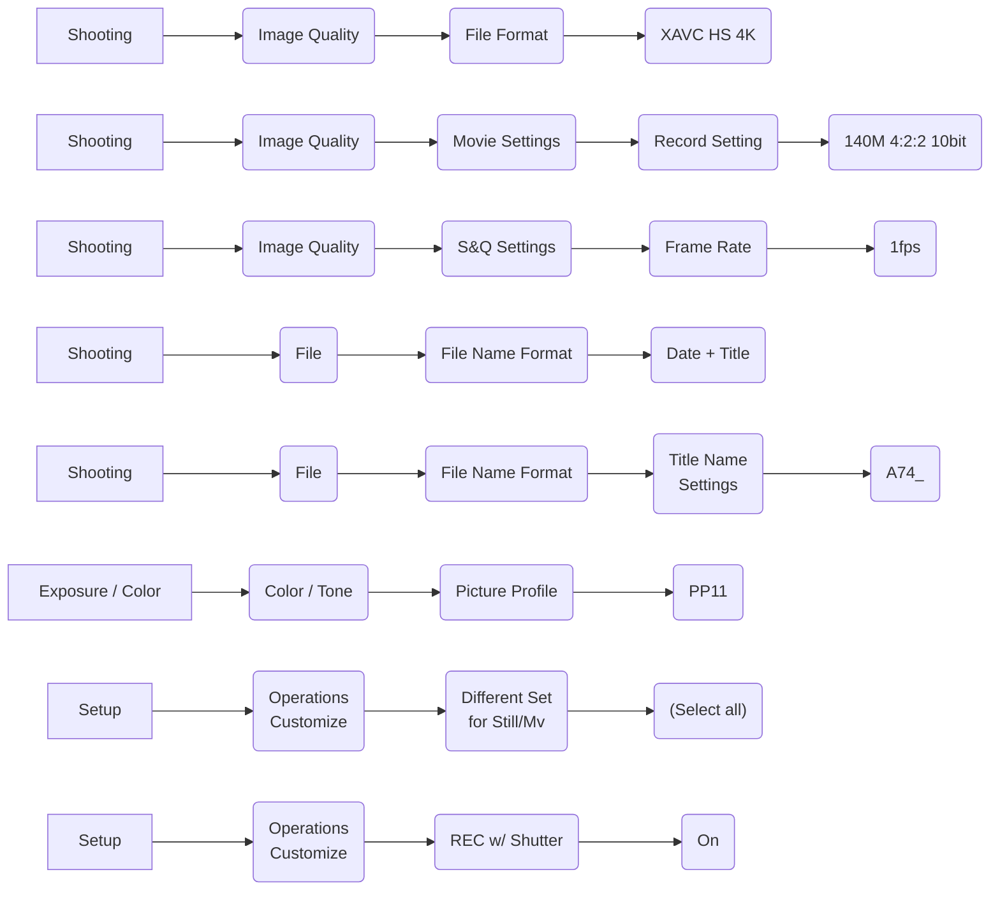

I wanted to summarize my notes about the Sony A7 IV settings.

Settings are separate into Photo and Video section to have them separated.

## Photo

```mermaid
flowchart LR
    AA1[My Menu \n Setting] --> AA2(Add Item)                --> AA3(Drive Mode)                  --> AA4(Interval \n Shoot Func.)
    AB1[My Menu \n Setting] --> AB2(Add Item)                --> AB3(Drive Mode)                  --> AB4(Bracket \n Settings)
    AC1[My Menu \n Setting] --> AC2(Add Item)                --> AC3(Finder / Monitor)            --> AC4(Monitor \n Brightness)
    AD1[My Menu \n Setting] --> AD2(Add Item)                --> AD3(Zebra Display)               --> AD4(Zebra Display)
    AE1[My Menu \n Setting] --> AE2(Add Item)                --> AE3(Zebra Display)               --> AE4(Bluetooth)                --> AE5(Bluetooth \n Function)
    AF1[My Menu \n Setting] --> AF2(Add Item)                --> AF3(Finder Monitor)              --> AF4(Select \n Finder/Monitor)
    AG1[Shooting]           --> AG2(Image Quality)           --> AG3(JPEG/HEIF Switch)            --> AG4("HEIF (4:2:0)")
    AH1[Shooting]           --> AH2(Image Quality)           --> AH3(Image Quality \n Settings)   --> AH4(Slot 1)                   --> AH5(File Format)                        --> AH6(RAW)
    AI1[Shooting]           --> AI2(Image Quality)           --> AI3(Image Quality \n Settings)   --> AI4(Slot 1)                   --> AI5(RAW \n File Type)                   --> AI6(Losseless \n Comp)
    AJ1[Shooting]           --> AJ2(Image Quality)           --> AJ3(Lens \n Compensation)        --> AJ4(Distortion Comp.)         --> AJ5(Auto)
    AK1[Shooting]           --> AK2(Media)                   --> AK3(Rec. Media \n Settings)      --> AK4(Auto Switch Media)
    AL1[Shooting]           --> AL2(File)                    --> AL3(File/Folder \n Settings)     --> AL4(Set File Name)            --> AL5("A74")
    AM1[Shooting]           --> AM2(File)                    --> AM3(Copyright Info)              --> AM4(Write Copyright \n Info)  --> AM5(On)
    AN1[Shooting]           --> AN2(File)                    --> AN3(Copyright Info)              --> AN4(Set Photographer)         --> AN5("My Name")
    AO1[Shooting]           --> AO2(File)                    --> AO3(Copyright Info)              --> AO4(Set Copyright)            --> AO5("CC BY-SA")
    AP1[Shooting]           --> AP2(File)                    --> AP3(Write \n Serial Number)      --> AP4(On)
    AQ1[Shooting]           --> AQ2(Drive Mode)              --> AQ3(Drive Mode)                  --> AQ4(Cont. Shooting:)          --> AQ5(Mid)
    AR1[Shooting]           --> AR2(Drive Mode)              --> AR3(Drive Mode)                  --> AR4("Self-timer(Single):")    --> AR5(2 sec)
    AS1[Shooting]           --> AS2(Drive Mode)              --> AS3(Interval Shoot \n Func.)     --> AS4(Shooting \n start time)   --> AS5(2 sec)
    AT1[Shooting]           --> AT2(Drive Mode)              --> AT3(Interval Shoot \n Func.)     --> AT4(Shooting interval)        --> AT5(5 sec)
    AU1[Shooting]           --> AU2(Drive Mode)              --> AU3(Interval Shoot \n Func.)     --> AU4(Shooting interval)        --> AU5(Number of shots)                    --> AU6(300)
    AV1[Shooting]           --> AV2(Drive Mode)              --> AV3(Interval Shoot \n Func.)     --> AV4(Shooting interval)        --> AV5(AE Tracking \n Sensitivity)         --> AV6(Low)
    AW1[Exposure/Color]     --> AW2(Exposure)                --> AW3(ISO Range Limit)             --> AW4(50)                       --> AW5(12800)
    AX1[Exposure/Color]     --> AX2(Metering)                --> AX3(Spot Metering Point)         --> AX4(Focus Point Link)
    AY1[Exposure/Color]     --> AY2(Zebra Display)           --> AY3(Zebra Display)               --> AY4(On)
    AZ1[Focus]              --> AZ2(AF/MF)                   --> AZ3(Focus Mode)                  --> AZ4(Continuous AF)
    BA1[Focus]              --> BA2(AF/MF)                   --> BA3(AF Illuminator)              --> BA4(Off)
    BB1[Focus]              --> BB2(Focus Area)              --> BB3(Tracking:)                   --> BB4(Spot S)
    BC1[Focus]              --> BC2(Focus Area)              --> BC3(Focus Area Color)            --> BC4(Red)
    BD1[Focus]              --> BD2(Face/Eye AF)             --> BD3(Face/Eye Frame Disp.)        --> BD4(On)
    BE1[Focus]              --> BE2(Peaking \n Display)      --> BE3(On)
    BF1[Focus]              --> BF2(Peaking \n Display)      --> BF3(Peaking Color)               --> BF4(Red)
    BG1[Playback]           --> BG2(Magnification)           --> BG3(Enlarge Initial \n Position) --> BG4(Focused Position)
    BH1[Playback]           --> BH2(Delete)                  --> BH3(Delete pressing \n twice)    --> BH4(On)
    BI1[Playback]           --> BI2(Playback \n Option)      --> BI3(Focus \n Frame Display)      --> BI4(On)
    BJ1[Network]            --> BJ2(Smartphone \n Connect)   --> BJ3(Smartphone Regist.)
    BK1[Network]            --> BK2(Smartphone \n Connect)   --> BK3(Remote \n Shoot Setting)     --> BK4(Still Img. \n Save Dest.) --> BK5(Camera Only)
    BL1[Network]            --> BL2(Transfer \n Remote)      --> BL3(FTP Transfer \n Func.)       --> BL4(FTP Function)             --> BL5(On)
    BM1[Network]            --> BM2(Transfer \n Remote)      --> BM3(FTP Transfer \n Func.)       --> BM4(Server \n Setting)        --> BM5(Server 1)                           --> BM6(...)
    BN1[Network]            --> BN2(Transfer \n Remote)      --> BN3(FTP Transfer \n Func.)       --> BN4(FTP Transfer)             --> BN5(Target Group)                       --> BN6(This Media)
    BO1[Network]            --> BO2(Transfer \n Remote)      --> BO3(FTP Transfer \n Func.)       --> BO4(FTP Power \n Save)        --> BO5(On)
    BP1[Network]            --> BP2(Wi-Fi)                   --> BP3(Wi-Fi Frequency \n Band)     --> BP4(2.4 GHz)
    BQ1[Network]            --> BQ2(Wi-Fi)                   --> BQ3(Access Point \n Set.)        --> BQ4(2.4 GHz)
    BR1[Setup]              --> BR2(Operations \n Customize) --> BR3(Custom Key/Dial \n Set.)     --> BR4(Rear1)                    --> BR5(4)                                  --> BR6(Shutter/Silent) --> BR7(Switch \n Silent Mode)
    BS1[Setup]              --> BS2(Operations \n Customize) --> BS3(Custom Key/Dial \n Set.)     --> BS4(Rear1)                    --> BS5(2)                                  --> BS6(Image Quality)  --> BS7(APS-C S35 \n Full Frame)
    BT1[Setup]              --> BT2(Operations \n Customize) --> BT3(Custom Key/Dial \n Set.)     --> BT4(Dial/Wheel)               --> BT5(4)                                  --> BT6(Exposure)       --> BT7(ISO)
    BU1[Setup]              --> BU2(Operations \n Customize) --> BU3(Custom Key/Dial \n Set.)     --> BU4(Dial/Wheel)               --> BU5(Separate M mode \n and other modes)
    BV1[Setup]              --> BV2(Operations \n Customize) --> BV3(Fn Menu Settings)            --> BV4(Face/Eye AF)              --> BV5(Face/Eye \n Subject)
    BX1[Setup]              --> BX2(Operations \n Customize) --> BX3(Fn Menu Settings)            --> BX4(Exposure)                 --> BX5(ISO AUTO Min. SS)
    BY1[Setup]              --> BY2(Operations \n Customize) --> BY3(Fn Menu Settings)            --> BY4(Zebra Display)            --> BY5(Zebra Display)
    BZ1[Setup]              --> BZ2(Operations \n Customize) --> BZ3("DISP (Screen Disp) \n Set") --> BZ4(Finder)                   --> BZ5(Display All \n Info.)
    CA1[Setup]              --> CA2(Touch \n Operation)      --> CA3(Touch Operation)             --> CA4(On)
    CB1[Setup]              --> CB2(Touch \n Operation)      --> CB3(Touch Panel/Pad)             --> CB4(Touch Pad Only)
    CC1[Setup]              --> CC2(Touch \n Operation)      --> CC3(Touch Func. \n in Shooting)  --> CC4(Touch Focus)
    CD1[Setup]              --> CD2(Touch \n Operation)      --> CD3(Touch Pad Settings)          --> CD4(Operation Area)           --> CD5(Left 1/2)
    CE1[Setup]              --> CE2(Display \n Option)       --> CE3(Auto Review)                 --> CE4(2s)
    CF1[Setup]              --> CF2(Power Setting \n Option) --> CF3(Auto Power OFF \n Temp.)     --> CF4(High)
    CG1[Setup]              --> CG2(Sound Option)            --> CG3(Audio signals)               --> CG4(Off)
    CH1[Setup]              --> CH2(Setup Option)            --> CH3(Anti-dust Function)          --> CH4(Shutter When \n Pwr OFF)  --> CH5(On)
    CI1[Setup]              --> CI2(USB)                     --> CI3(USB Connection \n Mode)      --> CI4("MassStorage(MSC)")
```

## Video

Links:

- [Sony A7IV BEGINNER'S GUIDE to Custom Settings - Part 1](https://youtu.be/-HhGqIgPh5w)
- [Top 7 Settings to Change on Sony a7 IV](https://youtu.be/NtKcMXIPMK8)
- [Sony A7IV – Best Settings For Photography](https://youtu.be/lXQy1xWNyJM)
- [Sony A7 IV Beginners Guide - Set-Up, Menus, & How-To Use the Camera](https://youtu.be/Vt3g42Y56jI)
