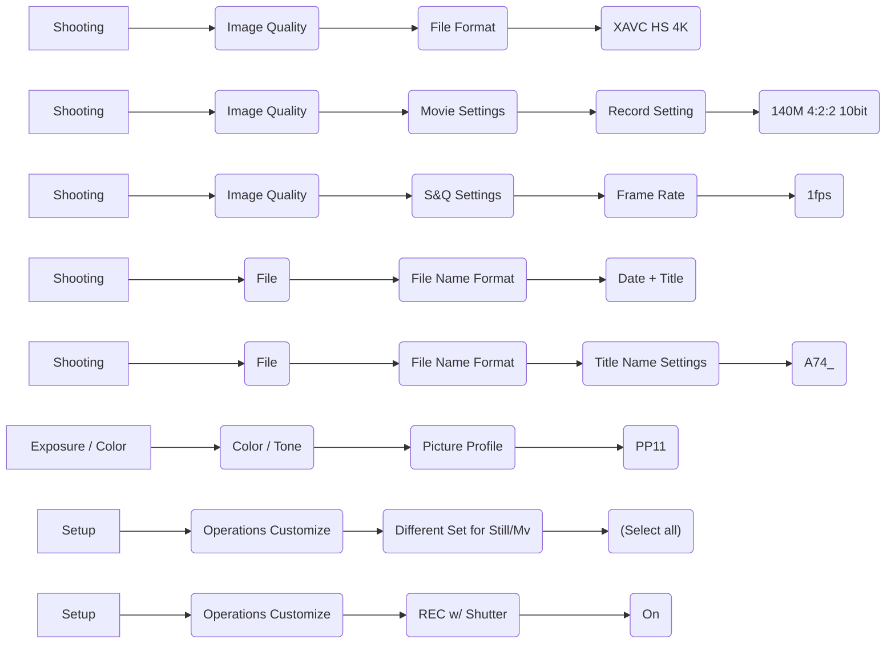

I wanted to summarize my notes about the Sony A7 IV settings.

Settings are separate into Photo and Video section to have them separated.

## Photo

```mermaid
flowchart LR
    AA1[My Menu Setting] --> AA2(Add Item)             --> AA3(Drive Mode)               --> AA4(Interval Shoot Func.)
    AB1[My Menu Setting] --> AB2(Add Item)             --> AB3(Drive Mode)               --> AB4(Bracket Settings)
    AC1[My Menu Setting] --> AC2(Add Item)             --> AC3(Finder / Monitor)         --> AC4(Monitor Brightness)
    AD1[My Menu Setting] --> AD2(Add Item)             --> AD3(Zebra Display)            --> AD4(Zebra Display)
    AE1[My Menu Setting] --> AE2(Add Item)             --> AE3(Zebra Display)            --> AE4(Bluetooth)             --> AE5(Bluetooth Function)
    AF1[My Menu Setting] --> AF2(Add Item)             --> AF3(Finder Monitor)           --> AF4(Select Finder/Monitor)
    AG1[My Menu Setting] --> AG2(Add Item)             --> AG3(Face/Eye AF)              --> AG4(Face/Eye Subject)
    AH1[Shooting]        --> AH2(Image Quality)        --> AH3(JPEG/HEIF Switch)         --> AH4("HEIF (4:2:0)")
    AI1[Shooting]        --> AI2(Image Quality)        --> AI3(Image Quality Settings)   --> AI4(Slot 1)                --> AI5(File Format)             --> AI6(RAW)
    AJ1[Shooting]        --> AJ2(Image Quality)        --> AJ3(Image Quality Settings)   --> AJ4(Slot 1)                --> AJ5(RAW File Type)           --> AJ6(Losseless Comp)
    AK1[Shooting]        --> AK2(Image Quality)        --> AK3(Lens Compensation)        --> AK4(Distortion Comp.)      --> AK5(Auto)
    AL1[Shooting]        --> AL2(Media)                --> AL3(Rec. Media Settings)      --> AL4(Auto Switch Media)
    AM1[Shooting]        --> AM2(File)                 --> AM3(File/Folder Settings)     --> AM4(Set File Name)         --> AM5("A74")
    AN1[Shooting]        --> AN2(File)                 --> AN3(Copyright Info)           --> AN4(Write Copyright Info)  --> AN5(On)
    AO1[Shooting]        --> AO2(File)                 --> AO3(Copyright Info)           --> AO4(Set Photographer)      --> AO5("My Name")
    AP1[Shooting]        --> AP2(File)                 --> AP3(Copyright Info)           --> AP4(Set Copyright)         --> AP5("CC BY-SA")
    AQ1[Shooting]        --> AQ2(File)                 --> AQ3(Write Serial Number)      --> AQ4(On)
    AR1[Shooting]        --> AR2(Drive Mode)           --> AR3(Drive Mode)               --> AR4(Cont. Shooting:)       --> AR5(Mid)
    AS1[Shooting]        --> AS2(Drive Mode)           --> AS3(Drive Mode)               --> AS4("Self-timer(Single):") --> AS5(2 sec)
    AT1[Shooting]        --> AT2(Drive Mode)           --> AT3(Interval Shoot Func.)     --> AT4(Shooting start time)   --> AT5(2 sec)
    AU1[Shooting]        --> AU2(Drive Mode)           --> AU3(Interval Shoot Func.)     --> AU4(Shooting interval)     --> AU5(5 sec)
    AV1[Shooting]        --> AV2(Drive Mode)           --> AV3(Interval Shoot Func.)     --> AV4(Shooting interval)     --> AV5(Number of shots)         --> AV6(300)
    AW1[Shooting]        --> AW2(Drive Mode)           --> AW3(Interval Shoot Func.)     --> AW4(Shooting interval)     --> AW5(AE Tracking Sensitivity) --> AW6(Low)
    AX1[Exposure/Color]  --> AX2(Exposure)             --> AX3(ISO Range Limit)          --> AX4(50) --> A5(12800)
    AY1[Exposure/Color]  --> AY2(Zebra Display)        --> AY3(Zebra Display)            --> AY4(On)
    AZ1[Focus]           --> AZ2(AF/MF)                --> AZ3(Focus Mode)               --> AZ4(Continuous AF)
    BA1[Focus]           --> BA2(AF/MF)                --> BA3(AF Illuminator)           --> B4(Off)
    BB1[Focus]           --> BB2(Focus Area)           --> BB3(Tracking:)                --> C4(Spot S)
    BC1[Focus]           --> BC2(Focus Area)           --> BC3(Focus Area Color)         --> D4(Red)
    BD1[Focus]           --> BD2(Peaking Display)      --> BD3(On)
    BE1[Focus]           --> BE2(Peaking Display)      --> BE3(Peaking Color)            --> BE4(Red)
    BF1[Playback]        --> BF2(Magnification)        --> BF3(Enlarge Initial Position) --> BF4(Focused Position)
    BG1[Playback]        --> BG2(Delete)               --> BG3(Delete pressing twice)    --> BG4(On)
    BH1[Playback]        --> BH2(Playback Option)      --> BH3(Focus Frame Display)      --> BH4(On)
    BI1[Network]         --> BI2(Smartphone Connect)   --> BI3(Smartphone Regist.)
    BJ1[Network]         --> BJ2(Smartphone Connect)   --> BJ3(Remote Shoot Setting)     --> BJ4(Still Img. Save Dest.)  --> BJ5(Camera Only)
    BK1[Setup]           --> BK2(Operations Customize) --> BK3(Custom Key/Dial Set.)     --> BK4(Rear1)                  --> BK5(4)                               --> A6(Shutter/Silent) --> A7(Switch Silent Mode)
    BL1[Setup]           --> BL2(Operations Customize) --> BL3(Custom Key/Dial Set.)     --> BL4(Dial/Wheel)             --> BL5(4)                               --> B6(Exposure)       --> B7(ISO)
    BM1[Setup]           --> BM2(Operations Customize) --> BM3(Custom Key/Dial Set.)     --> BM4(Dial/Wheel)             --> BM5(Separate M mode and other modes)
    BN1[Setup]           --> BN2(Operations Customize) --> BN3(Fn Menu Settings)         --> BN4(Face/Eye AF)            --> BN5(Face/Eye Subject)
    BO1[Setup]           --> BO2(Operations Customize) --> BO3(Fn Menu Settings)         --> BO4(Zebra Display)          --> BO5(Zebra Display)
    BP1[Setup]           --> BP2(Operations Customize) --> BP3("DISP (Screen Disp) Set") --> BP4(Finder)                 --> BP5(Display All Info.)
    BQ1[Setup]           --> BQ2(Touch Operation)      --> BQ3(Touch Operation)          --> BQ4(On)
    BR1[Setup]           --> BR2(Touch Operation)      --> BR3(Touch Panel/Pad)          --> BR4(Touch Pad Only)
    BS1[Setup]           --> BS2(Touch Operation)      --> BS3(Touch Func. in Shooting)  --> BS4(Touch Focus)
    BT1[Setup]           --> BT2(Touch Operation)      --> BT3(Touch Pad Settings)       --> BT4(Operation Area)         --> BT5(Left 1/2)
    BU1[Setup]           --> BU2(Display Option)       --> BU3(Auto Review)              --> BU4(2s)
    BV1[Setup]           --> BV2(Power Setting Option) --> BV3(Auto Power OFF Temp.)     --> BV4(High)
    BW1[Setup]           --> BW2(Sound Option)         --> BW3(Audio signals)            --> BW4(Off)
    BX1[Setup]           --> BX2(Setup Option)         --> BX3(Anti-dust Function)       --> BX4(Shutter When Pwr OFF)   --> BX5(On)
    BY1[Setup]           --> BY2(USB)                  --> BY3(USB Connection Mode)      --> BY4("MassStorage(MSC)")
```

## Video

```mermaid
flowchart LR
    A1[Shooting]         --> A2(Image Quality)        --> A3(File Format)                --> A4(XAVC HS 4K)
    B1[Shooting]         --> B2(Image Quality)        --> B3(Movie Settings)             --> B4(Record Setting)      --> B5(140M 4:2:2 10bit)
    C1[Shooting]         --> C2(Image Quality)        --> C3(S&Q Settings)               --> C4(Frame Rate)          --> C5(1fps)
    D1[Shooting]         --> D2(File)                 --> D3(File Name Format)           --> D4(Date + Title)
    E1[Shooting]         --> E2(File)                 --> E3(File Name Format)           --> E4(Title Name Settings) --> E5(A74_)
    F1[Exposure / Color] --> F2(Color / Tone)         --> F3(Picture Profile)            --> F4(PP11)
    G1[Setup]            --> G2(Operations Customize) --> G3(Different Set for Still/Mv) --> G4("(Select all)")
    H1[Setup]            --> H2(Operations Customize) --> H3(REC w/ Shutter)             --> H4(On)
```
