I had the opportunity to test the [Dell OptiPlex 3000 Thin Client](https://www.dell.com/en-us/shop/cty/pdp/spd/optiplex-3000-thin-client)
with TrueNAS Community Edition 25.04. The machine is equipped with 2 CPUs,
8GB of RAM, and 64GB of eMMC storage.

🕹️ Recorded screen cast:



## Installation

{:width="400"}

Put the [TrueNAS CE 25.04 ISO](https://www.truenas.com/download-truenas-scale/)
on a USB stick using [balenaEtcher](https://etcher.balena.io/).

> Make sure to disable **Secure Boot** in the BIOS before proceeding.

Boot TrueNAS from the USB stick and follow these steps:

* Shell
  * Run commands:

    ```bash
    sed -i 's/-n3:0:0/-n3:0:+16G/' /usr/lib/python3/dist-packages/truenas_installer/install.py
    exit
    ```

* Install/Upgrade
* Select the disk to install TrueNAS (`mmcblk0`)
* Administrative user (truenas_admin)
* ...

Links:

* [How to Install TrueNAS CORE on an SSD NVMe/SATA Partition and Reclaim Unused Boot-Pool Space](https://youtu.be/ZMSSE6FViak?si=b-sz-fPk6xwol0ea&t=50)
* [Install TrueNAS SCALE on a partition instead of the full disk](https://gist.github.com/gangefors/2029e26501601a99c501599f5b100aa6)

## Configuration


> The admin username for the TrueNAS WebUI is `truenas_admin`, and the password
> is the same as the root password set during the installation.

### [Settings](https://www.truenas.com/docs/scale/25.04/scaletutorials/systemsettings/)

Configure General Settings (GUI, Localization, and Email Settings), Advanced
Settings (Access), Services (SMB, SSH), and Shell (Create and Export pool):


### [Create and Import Storage pool](https://www.truenas.com/docs/scale/25.04/scaletutorials/storage/createpoolwizard/)

Import the previously created pool (`my-local-disk-pool`) and create a new pool
named `my-pool`:


### [Create Dataset](https://www.truenas.com/docs/scale/25.04/scaletutorials/datasets/datasetsscale/)

Create the `data` dataset in the `my-pool` pool and the `plex` dataset in the
`my-local-disk-pool` storage pool, ensuring proper permissions are configured
for each:


### [Configure Credentials](https://www.truenas.com/docs/scale/25.04/scaletutorials/credentials/backupcredentials/addcloudcredentials/)

Create a new user named `ruzickap`, and update the password and email address
for the existing `truenas_admin` user:


### [Add Applications](https://www.truenas.com/docs/scale/25.04/scaleuireference/apps/)

Configure the applications to use the `my-local-disk-pool` pool as their
designated storage location:


#### [OpenSpeedTest](https://openspeedtest.com/)

Install the [OpenSpeedTest](https://openspeedtest.com/) application to easily
measure network speed and performance:

{:width="100"}


Test the [OpenSpeedTest](https://openspeedtest.com/) web interface by accessing
it through the [local instance](http://truenas.local:30116/).

{:width="500"}

#### [File Browser](https://filebrowser.org/)

Add the [File Browser](https://filebrowser.org/) application to manage files
easily through a user-friendly web interface:

{:width="100"}


Test the [File Browser](https://filebrowser.org/) web interface by clicking the
[File Browser](http://truenas.local:30051/) link and using the following login
credentials:

* User: `admin`
* Password: `admin`

#### [qBittorrent](https://www.qbittorrent.org/)

Install the [qBittorrent](https://www.qbittorrent.org/) application to download
torrents:

{:width="100"}


##### [qBittorrent](https://www.qbittorrent.org/) Configuration

It is necessary to configure qBittorrent to work properly with the configured
pools and datasets.


Obtain the username and password for qBittorrent:

```mermaid
graph LR
    subgraph truenas[TrueNAS]
      apps[Apps]
    end
    subgraph applications_installed_dashboard[Applications Installed]
      apps --> qbittorrent[qbittorrent]
      qbittorrent --> workloads[Workloads]
      workloads --> qbittorrent_running[qbittorrent – Running]
      qbittorrent_running --> view_logs[View Logs]
      view_logs --> password[A temporary password is provided for this session: xxxxxx]
    end
    click apps "https://truenas.local/ui/apps/installed"
```



Access the [qBittorrent](http://truenas.local:30024/) web interface and log in
using the credentials obtained from the logs.

Click the **Options** icon (typically a gear symbol) at the top and configure
the following settings:


#### [Plex](https://www.plex.tv/)

Install the [Plex](https://www.plex.tv/) application for media streaming:

{:width="100"}


{:width="200"}

### [Configure Data Protection](https://www.truenas.com/docs/scale/25.04/scaletutorials/dataprotection/cloudsynctasks/)

Configure Cloud Sync Tasks to back up Plex data to Microsoft OneDrive, and
schedule regular S.M.A.R.T. tests:


Enjoy ... 😉
