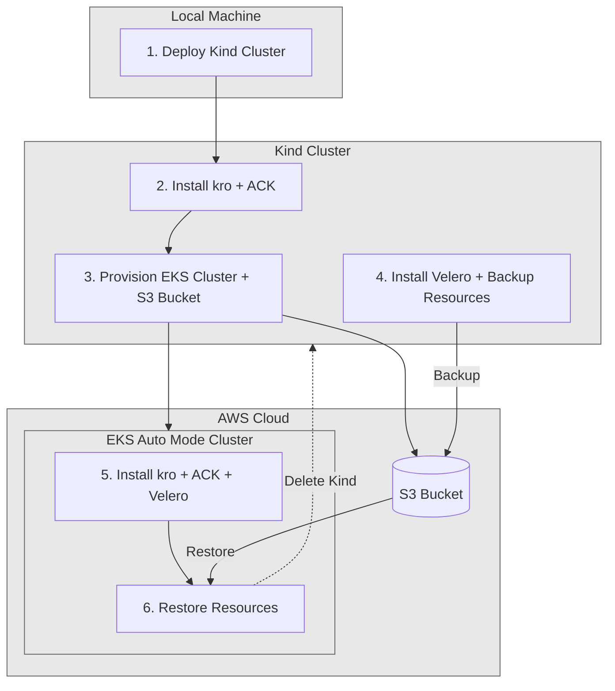

This post demonstrates how to use a temporary Kind cluster with [AWS Controllers
for Kubernetes (ACK)](https://aws-controllers-k8s.github.io/community/) and
[Kubernetes Resource Orchestrator (kro)](https://kro.run/) to bootstrap
a production EKS Auto Mode Cluster that manages itself. The process
involves creating AWS resources including S3 bucket and EKS Auto Mode
Clusters using native Kubernetes APIs, backing up those resources with Velero,
and restoring them to the new EKS Auto Mode Cluster - effectively making
it self-managed.

## Requirements

- [AWS account](https://aws.amazon.com/) with appropriate permissions
- [AWS CLI](https://aws.amazon.com/cli/)
- [kubectl](https://kubernetes.io/docs/tasks/tools/)
- [Helm](https://helm.sh/)
- [kind](https://kind.sigs.k8s.io/)
- [Velero CLI](https://velero.io/docs/main/basic-install/#install-the-cli)

## Architecture Overview

The bootstrap process follows these steps:

1. Deploy Kind cluster locally
2. Install kro and ACK controllers on Kind cluster
3. Use ACK + kro to provision EKS Auto Mode Cluster and S3 bucket
4. Install Velero on Kind cluster and backup kro + ACK resources
5. Install kro, ACK controllers, and Velero on EKS Auto Mode Cluster
6. Restore kro and ACK resources to EKS Auto Mode Cluster
7. Delete Kind cluster - EKS Auto Mode Cluster now manages itself



ACK provides Kubernetes CRDs for AWS services, while kro orchestrates
complex resource dependencies, creating a powerful infrastructure
management platform.

## Prerequisites

You will need to configure the [AWS CLI](https://docs.aws.amazon.com/cli/latest/userguide/cli-chap-configure.html)
and set up other necessary secrets and variables:

```shell
# AWS Credentials
export AWS_ACCESS_KEY_ID="xxxxxxxxxxxxxxxxxx"
export AWS_SECRET_ACCESS_KEY="xxxxxxxxxxxxxxxxxxxxxxxxxxxxxxxxxxxxxx"
export AWS_SESSION_TOKEN="xxxxxxxx"
export AWS_ROLE_TO_ASSUME="arn:aws:iam::7xxxxxxxxxx7:role/Gixxxxxxxxxxxxxxxxxxxxle"
```

If you plan to follow this document and its tasks, you will need to set up a
few environment variables, such as:

```bash
# AWS Region
export AWS_DEFAULT_REGION="${AWS_DEFAULT_REGION:-us-east-1}"
# Hostname / FQDN definitions
export CLUSTER_FQDN="k02.k8s.mylabs.dev"
# Cluster Name: k02
export CLUSTER_NAME="${CLUSTER_FQDN%%.*}"
export MY_EMAIL="petr.ruzicka@gmail.com"
export TMP_DIR="${TMP_DIR:-${PWD}}"
# Tags used to tag the AWS resources
export TAGS="${TAGS:-Owner=${MY_EMAIL},Environment=dev,Cluster=${CLUSTER_FQDN}}"
AWS_ACCOUNT_ID=$(aws sts get-caller-identity --query "Account" --output text) && export AWS_ACCOUNT_ID
mkdir -pv "${TMP_DIR}"/{${CLUSTER_FQDN},kind-${CLUSTER_NAME}-bootstrap}
```

## Create Kind Cluster

Create the Kind cluster:

```bash
kind create cluster --name "kind-${CLUSTER_NAME}-bootstrap" --kubeconfig "${TMP_DIR}/kind-${CLUSTER_NAME}-bootstrap/kubeconfig-kind-${CLUSTER_NAME}-bootstrap.yaml"
export KUBECONFIG="${TMP_DIR}/kind-${CLUSTER_NAME}-bootstrap/kubeconfig-kind-${CLUSTER_NAME}-bootstrap.yaml"
```

## Install kro on Kind Cluster

Install kro using Helm:

```bash
KRO_HELM_CHART_VERSION="0.6.2"
helm upgrade --install --version=${KRO_HELM_CHART_VERSION} --namespace kro-system --create-namespace kro oci://registry.k8s.io/kro/charts/kro
```

## Install ACK Controllers on Kind Cluster

Create namespace and configure AWS credentials for ACK:

```bash
kubectl create namespace ack-system
kubectl -n ack-system create secret generic aws-credentials --from-literal=credentials="[default]
aws_access_key_id=${AWS_ACCESS_KEY_ID}
aws_secret_access_key=${AWS_SECRET_ACCESS_KEY}
aws_session_token=${AWS_SESSION_TOKEN}
aws_role_to_assume=${AWS_ROLE_TO_ASSUME}"
```

Install ACK controllers (S3, IAM, EKS, EC2, KMS, CloudWatch Logs):

```bash
# renovate: datasource=github-tags depName=aws-controllers-k8s/ack-chart
ACK_HELM_CHART_VERSION="46.73.0"

cat > "${TMP_DIR}/kind-${CLUSTER_NAME}-bootstrap/helm_values-ack.yml" << EOF
eks:
  enabled: true
  aws:
    region: ${AWS_DEFAULT_REGION}
    credentials:
      secretName: aws-credentials
ec2:
  enabled: true
  aws:
    region: ${AWS_DEFAULT_REGION}
    credentials:
      secretName: aws-credentials
iam:
  enabled: true
  aws:
    region: ${AWS_DEFAULT_REGION}
    credentials:
      secretName: aws-credentials
kms:
  enabled: true
  aws:
    region: ${AWS_DEFAULT_REGION}
    credentials:
      secretName: aws-credentials
cloudwatchlogs:
  enabled: true
  aws:
    region: ${AWS_DEFAULT_REGION}
    credentials:
      secretName: aws-credentials
s3:
  enabled: true
  aws:
    region: ${AWS_DEFAULT_REGION}
    credentials:
      secretName: aws-credentials
EOF
helm upgrade --install --version=${ACK_HELM_CHART_VERSION} --namespace ack-system --values "${TMP_DIR}/kind-${CLUSTER_NAME}-bootstrap/helm_values-ack.yml" ack oci://public.ecr.aws/aws-controllers-k8s/ack-chart
```

## Create EKS Auto Mode Cluster with ACK and kro

Create an EKS Auto Mode Cluster using kro
ResourceGraphDefinitions. This approach uses
ResourceGraphDefinitions for the EKS Auto Mode Cluster
itself.

### Add KMS Key ResourceGraphDefinition

Define a KMS key used for encrypting EKS Auto Mode Cluster and S3 data:

```bash
tee "${TMP_DIR}/kind-${CLUSTER_NAME}-bootstrap/kro-kmskey-rgd.yaml" << 'EOF' | kubectl apply -f -
apiVersion: kro.run/v1alpha1
kind: ResourceGraphDefinition
metadata:
  name: kmskey
spec:
  schema:
    apiVersion: v1alpha1
    kind: KmsKey
    spec:
      name: string
      accountId: string
      region: string | default="us-east-1"
    status:
      keyARN: ${kmsKey.status.ackResourceMetadata.arn}
      keyID: ${kmsKey.status.keyID}
  resources:
  - id: kmsKey
    template:
      apiVersion: kms.services.k8s.aws/v1alpha1
      kind: Key
      metadata:
        name: "${schema.spec.name}-kms-key"
      spec:
        description: "KMS key for ${schema.spec.name} EKS Auto Mode Cluster"
        enableKeyRotation: true
        policy: |
          {
            "Version": "2012-10-17",
            "Id": "eks-key-policy-${schema.spec.name}",
            "Statement": [
              {
                "Sid": "Allow full access to the account root",
                "Effect": "Allow",
                "Principal": {
                  "AWS": "arn:aws:iam::${schema.spec.accountId}:root"
                },
                "Action": "kms:*",
                "Resource": "*"
              },
              {
                "Sid": "Allow AWS services to use the key",
                "Effect": "Allow",
                "Principal": {
                  "Service": [
                    "eks.amazonaws.com",
                    "logs.${schema.spec.region}.amazonaws.com"
                  ]
                },
                "Action": [
                  "kms:Encrypt",
                  "kms:Decrypt",
                  "kms:ReEncrypt*",
                  "kms:GenerateDataKey*",
                  "kms:CreateGrant",
                  "kms:DescribeKey"
                ],
                "Resource": "*",
                "Condition": {
                  "StringEquals": {
                    "aws:SourceAccount": "${schema.spec.accountId}"
                  }
                }
              },
              {
                "Sid": "Allow S3 access for Velero and EKS Auto Mode Cluster node volumes",
                "Effect": "Allow",
                "Principal": {
                  "AWS": "*"
                },
                "Action": [
                  "kms:Encrypt",
                  "kms:Decrypt",
                  "kms:ReEncrypt*",
                  "kms:GenerateDataKey*",
                  "kms:CreateGrant",
                  "kms:DescribeKey"
                ],
                "Resource": "*",
                "Condition": {
                  "StringEquals": {
                    "kms:ViaService": [
                      "s3.${schema.spec.region}.amazonaws.com",
                      "ec2.${schema.spec.region}.amazonaws.com"
                    ],
                    "kms:CallerAccount": "${schema.spec.accountId}"
                  }
                }
              }
            ]
          }
  - id: kmsKeyAlias
    template:
      apiVersion: kms.services.k8s.aws/v1alpha1
      kind: Alias
      metadata:
        name: "${schema.spec.name}-kms-alias"
      spec:
        name: "alias/${schema.spec.name}-eks-auto-mode-cluster"
        targetKeyID: ${kmsKey.status.keyID}
EOF
```

## Create S3 Bucket with ACK and kro

First, create a ResourceGroup that defines how to create an S3 bucket with
proper policies:

```bash
tee "${TMP_DIR}/kind-${CLUSTER_NAME}-bootstrap/kro-s3bucket-rgd.yaml" << 'EOF' | kubectl apply -f -
apiVersion: kro.run/v1alpha1
kind: ResourceGraphDefinition
metadata:
  name: s3-velero-bucket
spec:
  schema:
    apiVersion: v1alpha1
    kind: S3Bucket
    spec:
      bucketName: string
      region: string
      kmsKeyARN: string
      tags:
        owner: "string | default=\"\""
        environment: "string | default=\"dev\""
        cluster: "string | default=\"\""
    status:
      bucketARN: ${s3bucket.status.ackResourceMetadata.arn}
      bucketName: ${s3bucket.status.ackResourceMetadata.arn}
  resources:
    - id: s3bucket
      template:
        apiVersion: s3.services.k8s.aws/v1alpha1
        kind: Bucket
        metadata:
          name: ${schema.spec.bucketName}
        spec:
          name: ${schema.spec.bucketName}
          publicAccessBlock:
            blockPublicACLs: true
            blockPublicPolicy: true
            ignorePublicACLs: true
            restrictPublicBuckets: true
          encryption:
            rules:
              - applyServerSideEncryptionByDefault:
                  sseAlgorithm: aws:kms
                  kmsMasterKeyID: ${schema.spec.kmsKeyARN}
          tagging:
            tagSet:
              - key: "Name"
                value: "${schema.spec.bucketName}"
              - key: "Owner"
                value: "${schema.spec.tags.owner}"
              - key: "Environment"
                value: "${schema.spec.tags.environment}"
              - key: "Cluster"
                value: "${schema.spec.tags.cluster}"
          policy: |
            {
              "Version": "2012-10-17",
              "Statement": [
                {
                  "Sid": "ForceSSLOnlyAccess",
                  "Effect": "Deny",
                  "Principal": "*",
                  "Action": "s3:*",
                  "Resource": [
                    "arn:aws:s3:::${schema.spec.bucketName}",
                    "arn:aws:s3:::${schema.spec.bucketName}/*"
                  ],
                  "Condition": {
                    "Bool": {
                      "aws:SecureTransport": "false"
                    }
                  }
                }
              ]
            }
EOF
```

### Add CloudWatch LogGroup ResourceGraphDefinition

Create a CloudWatch LogGroup for EKS Auto Mode Cluster logs:

```bash
tee "${TMP_DIR}/kind-${CLUSTER_NAME}-bootstrap/kro-ekscloudwatchloggroup-loggroup-rgd.yaml" << 'EOF' | kubectl apply -f -
apiVersion: kro.run/v1alpha1
kind: ResourceGraphDefinition
metadata:
  name: ekscloudwatchloggroup
spec:
  schema:
    apiVersion: v1alpha1
    kind: EksCloudWatchLogGroup
    spec:
      name: string
      retentionDays: "integer | default=1"
      kmsKeyARN: "string | default=\"\""
      tags:
        owner: "string | default=\"\""
        environment: "string | default=\"dev\""
        cluster: "string | default=\"\""
    status:
      logGroupName: ${cloudWatchLogGroup.spec.name}
  resources:
  - id: cloudWatchLogGroup
    template:
      apiVersion: cloudwatchlogs.services.k8s.aws/v1alpha1
      kind: LogGroup
      metadata:
        name: "${schema.spec.name}-eks-auto-mode-cluster-logs"
      spec:
        name: "/aws/eks/${schema.spec.name}/cluster"
        retentionDays: ${schema.spec.retentionDays}
        kmsKeyID: ${schema.spec.kmsKeyARN}
        tags:
          Name: "/aws/eks/${schema.spec.name}/cluster"
          Owner: "${schema.spec.tags.owner}"
          Environment: "${schema.spec.tags.environment}"
          Cluster: "${schema.spec.tags.cluster}"
EOF
```

### Add VPC ResourceGraphDefinition

Create a VPC with networking resources for EKS Auto Mode Cluster:

```bash
tee "${TMP_DIR}/kind-${CLUSTER_NAME}-bootstrap/kro-eksvpc-rgd.yaml" << 'EOF' | kubectl apply -f -
apiVersion: kro.run/v1alpha1
kind: ResourceGraphDefinition
metadata:
  name: eksvpc
spec:
  schema:
    apiVersion: v1alpha1
    kind: EksVpc
    spec:
      name: string
      region: string | default="us-east-1"
      tags:
        owner: "string | default=\"\""
        environment: "string | default=\"dev\""
        cluster: "string | default=\"\""
      cidr:
        vpcCidr: "string | default=\"192.168.0.0/16\""
        publicSubnet1Cidr: "string | default=\"192.168.0.0/19\""
        publicSubnet2Cidr: "string | default=\"192.168.32.0/19\""
        privateSubnet1Cidr: "string | default=\"192.168.64.0/19\""
        privateSubnet2Cidr: "string | default=\"192.168.96.0/19\""
    status:
      vpcID: ${vpc.status.vpcID}
      publicSubnet1ID: ${publicSubnet1.status.subnetID}
      publicSubnet2ID: ${publicSubnet2.status.subnetID}
      privateSubnet1ID: ${privateSubnet1.status.subnetID}
      privateSubnet2ID: ${privateSubnet2.status.subnetID}
  resources:
  - id: vpc
    readyWhen:
      - ${vpc.status.state == "available"}
    template:
      apiVersion: ec2.services.k8s.aws/v1alpha1
      kind: VPC
      metadata:
        name: "${schema.spec.name}-eks-auto-mode-cluster-vpc"
      spec:
        cidrBlocks:
          - ${schema.spec.cidr.vpcCidr}
        enableDNSSupport: true
        enableDNSHostnames: true
        tags:
          - key: "Name"
            value: "${schema.spec.name}-eks-auto-mode-cluster-vpc"
          - key: "Owner"
            value: "${schema.spec.tags.owner}"
          - key: "Environment"
            value: "${schema.spec.tags.environment}"
          - key: "Cluster"
            value: "${schema.spec.tags.cluster}"
  - id: eip
    template:
      apiVersion: ec2.services.k8s.aws/v1alpha1
      kind: ElasticIPAddress
      metadata:
        name: "${schema.spec.name}-eks-auto-mode-cluster-eip"
      spec:
        tags:
          - key: "Name"
            value: "${schema.spec.name}-eks-auto-mode-cluster-eip"
          - key: "Owner"
            value: "${schema.spec.tags.owner}"
          - key: "Environment"
            value: "${schema.spec.tags.environment}"
          - key: "Cluster"
            value: "${schema.spec.tags.cluster}"
  - id: internetGateway
    template:
      apiVersion: ec2.services.k8s.aws/v1alpha1
      kind: InternetGateway
      metadata:
        name: "${schema.spec.name}-eks-auto-mode-cluster-igw"
      spec:
        vpc: ${vpc.status.vpcID}
        tags:
          - key: "Name"
            value: "${schema.spec.name}-eks-auto-mode-cluster-igw"
          - key: "Owner"
            value: "${schema.spec.tags.owner}"
          - key: "Environment"
            value: "${schema.spec.tags.environment}"
          - key: "Cluster"
            value: "${schema.spec.tags.cluster}"
  - id: natGateway
    readyWhen:
      - '${natGateway.status.state == "available"}'
    template:
      apiVersion: ec2.services.k8s.aws/v1alpha1
      kind: NATGateway
      metadata:
        name: "${schema.spec.name}-eks-auto-mode-cluster-nat-gateway"
      spec:
        subnetID: ${publicSubnet1.status.subnetID}
        allocationID: ${eip.status.allocationID}
        tags:
          - key: "Name"
            value: "${schema.spec.name}-eks-auto-mode-cluster-nat-gateway"
          - key: "Owner"
            value: "${schema.spec.tags.owner}"
          - key: "Environment"
            value: "${schema.spec.tags.environment}"
          - key: "Cluster"
            value: "${schema.spec.tags.cluster}"
  - id: publicRoutetable
    template:
      apiVersion: ec2.services.k8s.aws/v1alpha1
      kind: RouteTable
      metadata:
        name: "${schema.spec.name}-eks-auto-mode-cluster-public-routetable"
      spec:
        vpcID: ${vpc.status.vpcID}
        routes:
        - destinationCIDRBlock: 0.0.0.0/0
          gatewayID: ${internetGateway.status.internetGatewayID}
        tags:
          - key: "Name"
            value: "${schema.spec.name}-eks-auto-mode-cluster-public-routetable"
          - key: "Owner"
            value: "${schema.spec.tags.owner}"
          - key: "Environment"
            value: "${schema.spec.tags.environment}"
          - key: "Cluster"
            value: "${schema.spec.tags.cluster}"
  - id: privateRoutetable
    template:
      apiVersion: ec2.services.k8s.aws/v1alpha1
      kind: RouteTable
      metadata:
        name: "${schema.spec.name}-eks-auto-mode-cluster-private-routetable"
      spec:
        vpcID: ${vpc.status.vpcID}
        routes:
        - destinationCIDRBlock: 0.0.0.0/0
          natGatewayID: ${natGateway.status.natGatewayID}
        tags:
          - key: "Name"
            value: "${schema.spec.name}-eks-auto-mode-cluster-private-routetable"
          - key: "Owner"
            value: "${schema.spec.tags.owner}"
          - key: "Environment"
            value: "${schema.spec.tags.environment}"
          - key: "Cluster"
            value: "${schema.spec.tags.cluster}"
  # Public Subnet 1 (us-east-1a)
  - id: publicSubnet1
    readyWhen:
      - ${publicSubnet1.status.state == "available"}
    template:
      apiVersion: ec2.services.k8s.aws/v1alpha1
      kind: Subnet
      metadata:
        name: "${schema.spec.name}-eks-auto-mode-cluster-public-subnet1-${schema.spec.region}a"
      spec:
        availabilityZone: ${schema.spec.region}a
        cidrBlock: ${schema.spec.cidr.publicSubnet1Cidr}
        mapPublicIPOnLaunch: true
        vpcID: ${vpc.status.vpcID}
        routeTables:
        - ${publicRoutetable.status.routeTableID}
        tags:
          - key: "Name"
            value: "${schema.spec.name}-eks-auto-mode-cluster-public-subnet1-${schema.spec.region}a"
          - key: kubernetes.io/role/elb
            value: '1'
          - key: "Owner"
            value: "${schema.spec.tags.owner}"
          - key: "Environment"
            value: "${schema.spec.tags.environment}"
          - key: "Cluster"
            value: "${schema.spec.tags.cluster}"
  # Public Subnet 2 (us-east-1b)
  - id: publicSubnet2
    readyWhen:
      - ${publicSubnet2.status.state == "available"}
    template:
      apiVersion: ec2.services.k8s.aws/v1alpha1
      kind: Subnet
      metadata:
        name: "${schema.spec.name}-eks-auto-mode-cluster-public-subnet2-${schema.spec.region}b"
      spec:
        availabilityZone: ${schema.spec.region}b
        cidrBlock: ${schema.spec.cidr.publicSubnet2Cidr}
        mapPublicIPOnLaunch: true
        vpcID: ${vpc.status.vpcID}
        routeTables:
        - ${publicRoutetable.status.routeTableID}
        tags:
          - key: "Name"
            value: "${schema.spec.name}-eks-auto-mode-cluster-public-subnet2-${schema.spec.region}b"
          - key: kubernetes.io/role/elb
            value: '1'
          - key: "Owner"
            value: "${schema.spec.tags.owner}"
          - key: "Environment"
            value: "${schema.spec.tags.environment}"
          - key: "Cluster"
            value: "${schema.spec.tags.cluster}"
  # Private Subnet 1 (us-east-1a)
  - id: privateSubnet1
    readyWhen:
      - ${privateSubnet1.status.state == "available"}
    template:
      apiVersion: ec2.services.k8s.aws/v1alpha1
      kind: Subnet
      metadata:
        name: "${schema.spec.name}-eks-auto-mode-cluster-private-subnet1-${schema.spec.region}a"
      spec:
        availabilityZone: ${schema.spec.region}a
        cidrBlock: ${schema.spec.cidr.privateSubnet1Cidr}
        vpcID: ${vpc.status.vpcID}
        routeTables:
        - ${privateRoutetable.status.routeTableID}
        tags:
          - key: "Name"
            value: "${schema.spec.name}-eks-auto-mode-cluster-private-subnet1-${schema.spec.region}a"
          - key: kubernetes.io/role/internal-elb
            value: '1'
          - key: "Owner"
            value: "${schema.spec.tags.owner}"
          - key: "Environment"
            value: "${schema.spec.tags.environment}"
          - key: "Cluster"
            value: "${schema.spec.tags.cluster}"
  # Private Subnet 2 (us-east-1b)
  - id: privateSubnet2
    readyWhen:
      - ${privateSubnet2.status.state == "available"}
    template:
      apiVersion: ec2.services.k8s.aws/v1alpha1
      kind: Subnet
      metadata:
        name: "${schema.spec.name}-eks-auto-mode-cluster-private-subnet2-${schema.spec.region}b"
      spec:
        availabilityZone: ${schema.spec.region}b
        cidrBlock: ${schema.spec.cidr.privateSubnet2Cidr}
        vpcID: ${vpc.status.vpcID}
        routeTables:
        - ${privateRoutetable.status.routeTableID}
        tags:
          - key: "Name"
            value: "${schema.spec.name}-eks-auto-mode-cluster-private-subnet2-${schema.spec.region}b"
          - key: kubernetes.io/role/internal-elb
            value: '1'
          - key: "Owner"
            value: "${schema.spec.tags.owner}"
          - key: "Environment"
            value: "${schema.spec.tags.environment}"
          - key: "Cluster"
            value: "${schema.spec.tags.cluster}"
EOF
```

### Add Pod Identity Associations ResourceGraphDefinition

Create a ResourceGraphDefinition for Pod Identity Associations that sets up
Velero and ACK controller permissions:

```bash
tee "${TMP_DIR}/kind-${CLUSTER_NAME}-bootstrap/kro-podidentityassociations-rgd.yaml" << 'EOF' | kubectl apply -f -
apiVersion: kro.run/v1alpha1
kind: ResourceGraphDefinition
metadata:
  name: podidentityassociations
spec:
  schema:
    apiVersion: v1alpha1
    kind: PodIdentityAssociations
    spec:
      name: string
      clusterName: string
      accountId: string
      s3BucketName: string
      tags:
        owner: "string | default=\"\""
        environment: "string | default=\"dev\""
        cluster: "string | default=\"\""
  resources:
  - id: veleroPolicy
    template:
      apiVersion: iam.services.k8s.aws/v1alpha1
      kind: Policy
      metadata:
        name: ${schema.spec.name}-velero-policy
      spec:
        name: ${schema.spec.name}-velero-policy
        description: "Velero S3 backup and snapshot permissions"
        policyDocument: |
          {
            "Version": "2012-10-17",
            "Statement": [
              {
                "Sid": "S3ObjectAccess",
                "Effect": "Allow",
                "Action": [
                  "s3:GetObject",
                  "s3:DeleteObject",
                  "s3:PutObject",
                  "s3:AbortMultipartUpload",
                  "s3:ListMultipartUploadParts"
                ],
                "Resource": "arn:aws:s3:::${schema.spec.s3BucketName}/*"
              },
              {
                "Sid": "S3BucketAccess",
                "Effect": "Allow",
                "Action": [
                  "s3:ListBucket"
                ],
                "Resource": "arn:aws:s3:::${schema.spec.s3BucketName}"
              }
            ]
          }
        tags:
          - key: owner
            value: "${schema.spec.tags.owner}"
          - key: environment
            value: "${schema.spec.tags.environment}"
          - key: cluster
            value: "${schema.spec.tags.cluster}"
  - id: veleroRole
    template:
      apiVersion: iam.services.k8s.aws/v1alpha1
      kind: Role
      metadata:
        name: "${schema.spec.name}-velero-velero"
      spec:
        name: "${schema.spec.name}-velero-velero"
        assumeRolePolicyDocument: |
          {
            "Version": "2012-10-17",
            "Statement": [
              {
                "Effect": "Allow",
                "Principal": {
                  "Service": "pods.eks.amazonaws.com"
                },
                "Action": [
                  "sts:AssumeRole",
                  "sts:TagSession"
                ]
              }
            ]
          }
        policies:
          - ${veleroPolicy.status.ackResourceMetadata.arn}
        tags:
          - key: owner
            value: "${schema.spec.tags.owner}"
          - key: environment
            value: "${schema.spec.tags.environment}"
          - key: cluster
            value: "${schema.spec.tags.cluster}"
  - id: veleroPodIdentityAssociation
    template:
      apiVersion: eks.services.k8s.aws/v1alpha1
      kind: PodIdentityAssociation
      metadata:
        name: "${schema.spec.name}-velero-velero"
      spec:
        clusterName: ${schema.spec.clusterName}
        namespace: velero
        serviceAccount: velero-server
        roleARN: ${veleroRole.status.ackResourceMetadata.arn}
        tags:
          owner: "${schema.spec.tags.owner}"
          environment: "${schema.spec.tags.environment}"
          cluster: "${schema.spec.tags.cluster}"
  - id: ackCloudwatchlogsRole
    template:
      apiVersion: iam.services.k8s.aws/v1alpha1
      kind: Role
      metadata:
        name: "${schema.spec.name}-ack-cloudwatchlogs-controller"
      spec:
        name: "${schema.spec.name}-ack-cloudwatchlogs-controller"
        assumeRolePolicyDocument: |
          {
            "Version": "2012-10-17",
            "Statement": [
              {
                "Effect": "Allow",
                "Principal": {
                  "Service": "pods.eks.amazonaws.com"
                },
                "Action": [
                  "sts:AssumeRole",
                  "sts:TagSession"
                ]
              }
            ]
          }
        policies:
          - "arn:aws:iam::aws:policy/CloudWatchFullAccessV2"
        tags:
          - key: owner
            value: "${schema.spec.tags.owner}"
          - key: environment
            value: "${schema.spec.tags.environment}"
          - key: cluster
            value: "${schema.spec.tags.cluster}"
  - id: ackCloudwatchlogsPodIdentityAssociation
    template:
      apiVersion: eks.services.k8s.aws/v1alpha1
      kind: PodIdentityAssociation
      metadata:
        name: "${schema.spec.name}-ack-system-ack-cloudwatchlogs-controller"
      spec:
        clusterName: ${schema.spec.clusterName}
        namespace: ack-system
        serviceAccount: ack-cloudwatchlogs-controller
        roleARN: ${ackCloudwatchlogsRole.status.ackResourceMetadata.arn}
        tags:
          owner: "${schema.spec.tags.owner}"
          environment: "${schema.spec.tags.environment}"
          cluster: "${schema.spec.tags.cluster}"
  - id: ackEc2Role
    template:
      apiVersion: iam.services.k8s.aws/v1alpha1
      kind: Role
      metadata:
        name: "${schema.spec.name}-ack-ec2-controller"
      spec:
        name: "${schema.spec.name}-ack-ec2-controller"
        assumeRolePolicyDocument: |
          {
            "Version": "2012-10-17",
            "Statement": [
              {
                "Effect": "Allow",
                "Principal": {
                  "Service": "pods.eks.amazonaws.com"
                },
                "Action": [
                  "sts:AssumeRole",
                  "sts:TagSession"
                ]
              }
            ]
          }
        policies:
          - "arn:aws:iam::aws:policy/AmazonEC2FullAccess"
        tags:
          - key: owner
            value: "${schema.spec.tags.owner}"
          - key: environment
            value: "${schema.spec.tags.environment}"
          - key: cluster
            value: "${schema.spec.tags.cluster}"
  - id: ackEc2PodIdentityAssociation
    template:
      apiVersion: eks.services.k8s.aws/v1alpha1
      kind: PodIdentityAssociation
      metadata:
        name: "${schema.spec.name}-ack-system-ack-ec2-controller"
      spec:
        clusterName: ${schema.spec.clusterName}
        namespace: ack-system
        serviceAccount: ack-ec2-controller
        roleARN: ${ackEc2Role.status.ackResourceMetadata.arn}
        tags:
          owner: "${schema.spec.tags.owner}"
          environment: "${schema.spec.tags.environment}"
          cluster: "${schema.spec.tags.cluster}"
  - id: ackEksRole
    template:
      apiVersion: iam.services.k8s.aws/v1alpha1
      kind: Role
      metadata:
        name: "${schema.spec.name}-ack-eks-controller"
      spec:
        name: "${schema.spec.name}-ack-eks-controller"
        assumeRolePolicyDocument: |
          {
            "Version": "2012-10-17",
            "Statement": [
              {
                "Effect": "Allow",
                "Principal": {
                  "Service": "pods.eks.amazonaws.com"
                },
                "Action": [
                  "sts:AssumeRole",
                  "sts:TagSession"
                ]
              }
            ]
          }
        inlinePolicies:
          eks-controller-policy: |
            {
              "Version": "2012-10-17",
              "Statement": [
                {
                  "Effect": "Allow",
                  "Action": [
                    "eks:*",
                    "iam:GetRole",
                    "iam:PassRole",
                    "iam:ListAttachedRolePolicies",
                    "ec2:DescribeSubnets",
                    "kms:DescribeKey",
                    "kms:CreateGrant"
                  ],
                  "Resource": "*"
                }
              ]
            }
        tags:
          - key: owner
            value: "${schema.spec.tags.owner}"
          - key: environment
            value: "${schema.spec.tags.environment}"
          - key: cluster
            value: "${schema.spec.tags.cluster}"
  - id: ackEksPodIdentityAssociation
    template:
      apiVersion: eks.services.k8s.aws/v1alpha1
      kind: PodIdentityAssociation
      metadata:
        name: "${schema.spec.name}-ack-system-ack-eks-controller"
      spec:
        clusterName: ${schema.spec.clusterName}
        namespace: ack-system
        serviceAccount: ack-eks-controller
        roleARN: ${ackEksRole.status.ackResourceMetadata.arn}
        tags:
          owner: "${schema.spec.tags.owner}"
          environment: "${schema.spec.tags.environment}"
          cluster: "${schema.spec.tags.cluster}"
  - id: ackIamRole
    template:
      apiVersion: iam.services.k8s.aws/v1alpha1
      kind: Role
      metadata:
        name: "${schema.spec.name}-ack-iam-controller"
      spec:
        name: "${schema.spec.name}-ack-iam-controller"
        assumeRolePolicyDocument: |
          {
            "Version": "2012-10-17",
            "Statement": [
              {
                "Effect": "Allow",
                "Principal": {
                  "Service": "pods.eks.amazonaws.com"
                },
                "Action": [
                  "sts:AssumeRole",
                  "sts:TagSession"
                ]
              }
            ]
          }
        policies:
          - "arn:aws:iam::aws:policy/IAMFullAccess"
        tags:
          - key: owner
            value: "${schema.spec.tags.owner}"
          - key: environment
            value: "${schema.spec.tags.environment}"
          - key: cluster
            value: "${schema.spec.tags.cluster}"
  - id: ackIamPodIdentityAssociation
    template:
      apiVersion: eks.services.k8s.aws/v1alpha1
      kind: PodIdentityAssociation
      metadata:
        name: "${schema.spec.name}-ack-system-ack-iam-controller"
      spec:
        clusterName: ${schema.spec.clusterName}
        namespace: ack-system
        serviceAccount: ack-iam-controller
        roleARN: ${ackIamRole.status.ackResourceMetadata.arn}
        tags:
          owner: "${schema.spec.tags.owner}"
          environment: "${schema.spec.tags.environment}"
          cluster: "${schema.spec.tags.cluster}"
  - id: ackKmsRole
    template:
      apiVersion: iam.services.k8s.aws/v1alpha1
      kind: Role
      metadata:
        name: "${schema.spec.name}-ack-kms-controller"
      spec:
        name: "${schema.spec.name}-ack-kms-controller"
        assumeRolePolicyDocument: |
          {
            "Version": "2012-10-17",
            "Statement": [
              {
                "Effect": "Allow",
                "Principal": {
                  "Service": "pods.eks.amazonaws.com"
                },
                "Action": [
                  "sts:AssumeRole",
                  "sts:TagSession"
                ]
              }
            ]
          }
        inlinePolicies:
          kms-controller-policy: |
            {
              "Version": "2012-10-17",
              "Statement": [
                {
                  "Effect": "Allow",
                  "Action": "kms:*",
                  "Resource": "*"
                }
              ]
            }
        tags:
          - key: owner
            value: "${schema.spec.tags.owner}"
          - key: environment
            value: "${schema.spec.tags.environment}"
          - key: cluster
            value: "${schema.spec.tags.cluster}"
  - id: ackKmsPodIdentityAssociation
    template:
      apiVersion: eks.services.k8s.aws/v1alpha1
      kind: PodIdentityAssociation
      metadata:
        name: "${schema.spec.name}-ack-system-ack-kms-controller"
      spec:
        clusterName: ${schema.spec.clusterName}
        namespace: ack-system
        serviceAccount: ack-kms-controller
        roleARN: ${ackKmsRole.status.ackResourceMetadata.arn}
        tags:
          owner: "${schema.spec.tags.owner}"
          environment: "${schema.spec.tags.environment}"
          cluster: "${schema.spec.tags.cluster}"
  - id: ackS3Role
    template:
      apiVersion: iam.services.k8s.aws/v1alpha1
      kind: Role
      metadata:
        name: "${schema.spec.name}-ack-s3-controller"
      spec:
        name: "${schema.spec.name}-ack-s3-controller"
        assumeRolePolicyDocument: |
          {
            "Version": "2012-10-17",
            "Statement": [
              {
                "Effect": "Allow",
                "Principal": {
                  "Service": "pods.eks.amazonaws.com"
                },
                "Action": [
                  "sts:AssumeRole",
                  "sts:TagSession"
                ]
              }
            ]
          }
        policies:
          - "arn:aws:iam::aws:policy/AmazonS3FullAccess"
        tags:
          - key: owner
            value: "${schema.spec.tags.owner}"
          - key: environment
            value: "${schema.spec.tags.environment}"
          - key: cluster
            value: "${schema.spec.tags.cluster}"
  - id: ackS3PodIdentityAssociation
    template:
      apiVersion: eks.services.k8s.aws/v1alpha1
      kind: PodIdentityAssociation
      metadata:
        name: "${schema.spec.name}-ack-system-ack-s3-controller"
      spec:
        clusterName: ${schema.spec.clusterName}
        namespace: ack-system
        serviceAccount: ack-s3-controller
        roleARN: ${ackS3Role.status.ackResourceMetadata.arn}
        tags:
          owner: "${schema.spec.tags.owner}"
          environment: "${schema.spec.tags.environment}"
          cluster: "${schema.spec.tags.cluster}"
EOF
```

### Add EKS Auto Mode Cluster ResourceGraphDefinition

Create the EKS Auto Mode Cluster ResourceGraphDefinition:

```bash
tee "${TMP_DIR}/kind-${CLUSTER_NAME}-bootstrap/kro-eks-auto-mode-cluster-rgd.yaml" << 'EOF' | kubectl apply -f -
apiVersion: kro.run/v1alpha1
kind: ResourceGraphDefinition
metadata:
  name: eks-auto-mode-cluster
spec:
  schema:
    apiVersion: v1alpha1
    kind: EksAutoModeCluster
    spec:
      name: string
      region: string | default="us-east-1"
      k8sVersion: "string | default=\"\""
      accountId: string
      adminRoleARN: string
      tags:
        owner: "string | default=\"\""
        environment: "string | default=\"dev\""
        cluster: "string | default=\"\""
      s3BucketName: string
      vpcConfig:
        endpointPrivateAccess: "boolean | default=true"
        endpointPublicAccess: "boolean | default=true"
      nodeGroupConfig:
        desiredSize: "integer | default=2"
        minSize: "integer | default=1"
        maxSize: "integer | default=3"
        instanceType: "string | default=\"t4g.medium\""
        volumeSize: "integer | default=20"
      cidr:
        vpcCidr: "string | default=\"192.168.0.0/16\""
        publicSubnet1Cidr: "string | default=\"192.168.0.0/19\""
        publicSubnet2Cidr: "string | default=\"192.168.32.0/19\""
        privateSubnet1Cidr: "string | default=\"192.168.64.0/19\""
        privateSubnet2Cidr: "string | default=\"192.168.96.0/19\""
    status:
      clusterARN: ${cluster.status.ackResourceMetadata.arn}
      clusterStatus: ${cluster.status.status}
      vpcID: ${eksVpc.status.vpcID}
      privateSubnet1ID: ${eksVpc.status.privateSubnet1ID}
      privateSubnet2ID: ${eksVpc.status.privateSubnet2ID}
      kmsKeyARN: ${kmsKey.status.keyARN}
      s3BucketARN: ${s3Bucket.status.bucketARN}
  resources:
  - id: kmsKey
    template:
      apiVersion: kro.run/v1alpha1
      kind: KmsKey
      metadata:
        name: "${schema.spec.name}-kms"
      spec:
        name: "${schema.spec.name}"
        accountId: "${schema.spec.accountId}"
        region: ${schema.spec.region}
  - id: s3Bucket
    template:
      apiVersion: kro.run/v1alpha1
      kind: S3Bucket
      metadata:
        name: "${schema.spec.name}-s3"
      spec:
        bucketName: ${schema.spec.s3BucketName}
        region: ${schema.spec.region}
        kmsKeyARN: ${kmsKey.status.keyARN}
        tags:
          owner: "${schema.spec.tags.owner}"
          environment: "${schema.spec.tags.environment}"
          cluster: "${schema.spec.tags.cluster}"
  - id: cloudWatchLogGroup
    template:
      apiVersion: kro.run/v1alpha1
      kind: EksCloudWatchLogGroup
      metadata:
        name: "${schema.spec.name}-logs"
      spec:
        name: "${schema.spec.name}"
        kmsKeyARN: ${kmsKey.status.keyARN}
        tags:
          owner: "${schema.spec.tags.owner}"
          environment: "${schema.spec.tags.environment}"
          cluster: "${schema.spec.tags.cluster}"
  - id: eksVpc
    template:
      apiVersion: kro.run/v1alpha1
      kind: EksVpc
      metadata:
        name: "${schema.spec.name}-vpc"
      spec:
        name: "${schema.spec.name}"
        region: ${schema.spec.region}
        tags:
          owner: "${schema.spec.tags.owner}"
          environment: "${schema.spec.tags.environment}"
          cluster: "${schema.spec.tags.cluster}"
        cidr:
          vpcCidr: ${schema.spec.cidr.vpcCidr}
          publicSubnet1Cidr: ${schema.spec.cidr.publicSubnet1Cidr}
          publicSubnet2Cidr: ${schema.spec.cidr.publicSubnet2Cidr}
          privateSubnet1Cidr: ${schema.spec.cidr.privateSubnet1Cidr}
          privateSubnet2Cidr: ${schema.spec.cidr.privateSubnet2Cidr}
  - id: clusterRole
    template:
      apiVersion: iam.services.k8s.aws/v1alpha1
      kind: Role
      metadata:
        name: "${schema.spec.name}-eks-auto-mode-cluster-role"
      spec:
        name: "${schema.spec.name}-eks-auto-mode-cluster-role"
        description: "EKS Auto Mode Cluster IAM role"
        policies:
          - arn:aws:iam::aws:policy/AmazonEKSClusterPolicy
          - arn:aws:iam::aws:policy/AmazonEKSComputePolicy
          - arn:aws:iam::aws:policy/AmazonEKSBlockStoragePolicy
          - arn:aws:iam::aws:policy/AmazonEKSLoadBalancingPolicy
          - arn:aws:iam::aws:policy/AmazonEKSNetworkingPolicy
        assumeRolePolicyDocument: |
          {
            "Version": "2012-10-17",
            "Statement": [
              {
                "Effect": "Allow",
                "Principal": {
                  "Service": "eks.amazonaws.com"
                },
                "Action": [
                  "sts:AssumeRole",
                  "sts:TagSession"
                ]
              }
            ]
          }
        tags:
          - key: owner
            value: "${schema.spec.tags.owner}"
          - key: environment
            value: "${schema.spec.tags.environment}"
          - key: cluster
            value: "${schema.spec.tags.cluster}"
  - id: nodeRole
    template:
      apiVersion: iam.services.k8s.aws/v1alpha1
      kind: Role
      metadata:
        name: "${schema.spec.name}-ng-role"
      spec:
        name: "${schema.spec.name}-nodegroup-${schema.spec.name}-ng-NodeRole"
        assumeRolePolicyDocument: |
          {
            "Version": "2012-10-17",
            "Statement": [
              {
                "Effect": "Allow",
                "Principal": {
                  "Service": "ec2.amazonaws.com"
                },
                "Action": [
                  "sts:AssumeRole",
                  "sts:TagSession"
                ]
              }
            ]
          }
        policies:
          - "arn:aws:iam::aws:policy/AmazonEKSWorkerNodePolicy"
          - "arn:aws:iam::aws:policy/AmazonSSMManagedInstanceCore"
        tags:
          - key: owner
            value: "${schema.spec.tags.owner}"
          - key: environment
            value: "${schema.spec.tags.environment}"
          - key: cluster
            value: "${schema.spec.tags.cluster}"
  - id: cluster
    readyWhen:
      - '${cluster.status.status == "ACTIVE"}'
    template:
      apiVersion: eks.services.k8s.aws/v1alpha1
      kind: Cluster
      metadata:
        name: ${schema.spec.name}
        annotations:
          clusterRoleArn: ${clusterRole.status.ackResourceMetadata.arn}
      spec:
        name: ${schema.spec.name}
        roleARN: ${clusterRole.status.ackResourceMetadata.arn}
        version: ${schema.spec.k8sVersion}
        accessConfig:
          authenticationMode: API_AND_CONFIG_MAP
          bootstrapClusterCreatorAdminPermissions: true
        computeConfig:
          enabled: true
          nodeRoleARN: ${nodeRole.status.ackResourceMetadata.arn}
          nodePools:
            - system
            - general-purpose
        kubernetesNetworkConfig:
          ipFamily: ipv4
          elasticLoadBalancing:
            enabled: true
        logging:
          clusterLogging:
            - enabled: true
              types:
                - api
                - audit
                - authenticator
                - controllerManager
                - scheduler
        storageConfig:
          blockStorage:
            enabled: true
        resourcesVPCConfig:
          endpointPrivateAccess: ${schema.spec.vpcConfig.endpointPrivateAccess}
          endpointPublicAccess: ${schema.spec.vpcConfig.endpointPublicAccess}
          subnetIDs:
            - ${eksVpc.status.privateSubnet1ID}
            - ${eksVpc.status.privateSubnet2ID}
        encryptionConfig:
          - provider:
              keyARN: ${kmsKey.status.keyARN}
            resources:
              - secrets
        tags:
          owner: "${schema.spec.tags.owner}"
          environment: "${schema.spec.tags.environment}"
          cluster: "${schema.spec.tags.cluster}"
  - id: addonPodIdentity
    template:
      apiVersion: eks.services.k8s.aws/v1alpha1
      kind: Addon
      metadata:
        name: ${schema.spec.name}-pod-identity
        annotations:
          cluster-arn: ${cluster.status.ackResourceMetadata.arn}
      spec:
        name: eks-pod-identity-agent
        clusterName: ${cluster.spec.name}
  - id: accessEntry
    template:
      apiVersion: eks.services.k8s.aws/v1alpha1
      kind: AccessEntry
      metadata:
        name: ${schema.spec.name}-admin-access
        # Reference cluster.status to ensure kro waits for cluster to be ACTIVE
        annotations:
          cluster-arn: ${cluster.status.ackResourceMetadata.arn}
      spec:
        clusterName: ${cluster.spec.name}
        principalARN: ${schema.spec.adminRoleARN}
        type: STANDARD
        accessPolicies:
          - policyARN: "arn:aws:eks::aws:cluster-access-policy/AmazonEKSClusterAdminPolicy"
            accessScope:
              type: cluster
  - id: podIdentityAssociations
    template:
      apiVersion: kro.run/v1alpha1
      kind: PodIdentityAssociations
      metadata:
        name: "${schema.spec.name}-pod-identity-associations"
      spec:
        name: ${schema.spec.name}
        clusterName: ${schema.spec.name}
        accountId: "${schema.spec.accountId}"
        s3BucketName: ${schema.spec.s3BucketName}
        tags:
          owner: "${schema.spec.tags.owner}"
          environment: "${schema.spec.tags.environment}"
          cluster: "${schema.spec.tags.cluster}"
EOF
kubectl wait --for=jsonpath='{.status.state}'=Active resourcegraphdefinition/eks-auto-mode-cluster -n kro-system --timeout=5m
```

### Create EKS Auto Mode Cluster Instance

Now create a single instance that provisions EKS cluster using the expanded
combined ResourceGraphDefinition:

```bash
tee "${TMP_DIR}/kind-${CLUSTER_NAME}-bootstrap/kro-eks-auto-mode-cluster.yaml" << EOF | kubectl apply -f -
apiVersion: kro.run/v1alpha1
kind: EksAutoModeCluster
metadata:
  name: ${CLUSTER_NAME}
  namespace: kro-system
spec:
  name: ${CLUSTER_NAME}
  region: ${AWS_DEFAULT_REGION}
  accountId: "${AWS_ACCOUNT_ID}"
  adminRoleARN: "${AWS_ROLE_TO_ASSUME%/*}/admin"
  s3BucketName: ${CLUSTER_FQDN}
  tags:
    owner: ${MY_EMAIL}
    environment: dev
    cluster: ${CLUSTER_FQDN}
EOF
kubectl wait --for=jsonpath='{.status.clusterStatus}'=ACTIVE eksautomodecluster/${CLUSTER_NAME} -n kro-system --timeout=30m
```

## Install Velero

{:width="600"}

Install the `velero` [Helm chart](https://artifacthub.io/packages/helm/vmware-tanzu/velero)
and modify its [default values](https://github.com/vmware-tanzu/helm-charts/blob/velero-11.3.2/charts/velero/values.yaml):

```bash
# renovate: datasource=helm depName=velero registryUrl=https://vmware-tanzu.github.io/helm-charts
VELERO_HELM_CHART_VERSION="11.3.2"

helm repo add --force-update vmware-tanzu https://vmware-tanzu.github.io/helm-charts
cat > "${TMP_DIR}/kind-${CLUSTER_NAME}-bootstrap/helm_values-velero.yml" << EOF
initContainers:
  - name: velero-plugin-for-aws
    # renovate: datasource=docker depName=velero/velero-plugin-for-aws extractVersion=^(?<version>.+)$
    image: velero/velero-plugin-for-aws:v1.13.2
    volumeMounts:
      - mountPath: /target
        name: plugins
upgradeCRDs: false
configuration:
  backupStorageLocation:
    - name: default
      provider: aws
      bucket: ${CLUSTER_FQDN}
      prefix: velero
      config:
        region: ${AWS_DEFAULT_REGION}
credentials:
  useSecret: true
  secretContents:
    cloud: |
      [default]
      aws_access_key_id=${AWS_ACCESS_KEY_ID}
      aws_secret_access_key=${AWS_SECRET_ACCESS_KEY}
      aws_session_token=${AWS_SESSION_TOKEN}
snapshotsEnabled: false
EOF
helm upgrade --install --version "${VELERO_HELM_CHART_VERSION}" --namespace velero --create-namespace --wait --values "${TMP_DIR}/kind-${CLUSTER_NAME}-bootstrap/helm_values-velero.yml" velero vmware-tanzu/velero
```

Create a Velero backup for kro and ACK resources. Use resource
filtering with API group wildcards to capture `kro.run` objects
(cluster-scoped RGDs and namespaced instances) and
`services.k8s.aws` objects (ACK-managed AWS resources), scoped
to `kro-system`:

```bash
tee "${TMP_DIR}/kind-${CLUSTER_NAME}-bootstrap/velero-kro-ack-backup.yaml" << EOF | kubectl apply -f -
apiVersion: velero.io/v1
kind: Backup
metadata:
  name: kro-ack-backup
  namespace: velero
spec:
  # Include kro-system namespace where kro instances are created
  includedNamespaces:
    - kro-system
  # Include cluster-scoped kro resources (ResourceGraphDefinitions)
  includedClusterScopedResources:
    - "*.kro.run"
  # Include namespaced kro instances and ACK resources (with status)
  includedNamespaceScopedResources:
    - "*.kro.run"
    - "*.services.k8s.aws"
EOF
```

---

## Configure Access to EKS Auto Mode Cluster

Update kubeconfig for the new EKS Auto Mode cluster:

```bash
export KUBECONFIG="${TMP_DIR}/${CLUSTER_FQDN}/kubeconfig-${CLUSTER_NAME}.conf"
aws eks update-kubeconfig --region "${AWS_DEFAULT_REGION}" --name "${CLUSTER_NAME}" --kubeconfig "${KUBECONFIG}"
```

## Install kro on EKS Auto Mode Cluster

Install kro on the EKS Auto Mode cluster:

```bash
KRO_HELM_CHART_VERSION="0.6.2"
helm upgrade --install --namespace kro-system --create-namespace --version=${KRO_HELM_CHART_VERSION} kro oci://registry.k8s.io/kro/charts/kro
```

## Install ACK Controllers on EKS Auto Mode Cluster

Install ACK controllers on the EKS Auto Mode cluster:

Install ACK controllers (S3, IAM, EKS, EC2, KMS, CloudWatch Logs):

```bash
# renovate: datasource=github-tags depName=aws-controllers-k8s/ack-chart
ACK_HELM_CHART_VERSION="46.73.0"

cat > "${TMP_DIR}/${CLUSTER_FQDN}/helm_values-ack.yml" << EOF
eks:
  enabled: true
  aws:
    region: ${AWS_DEFAULT_REGION}
ec2:
  enabled: true
  aws:
    region: ${AWS_DEFAULT_REGION}
iam:
  enabled: true
  aws:
    region: ${AWS_DEFAULT_REGION}
kms:
  enabled: true
  aws:
    region: ${AWS_DEFAULT_REGION}
cloudwatchlogs:
  enabled: true
  aws:
    region: ${AWS_DEFAULT_REGION}
s3:
  enabled: true
  aws:
    region: ${AWS_DEFAULT_REGION}
EOF
helm upgrade --install --version=${ACK_HELM_CHART_VERSION} --namespace ack-system --create-namespace --values "${TMP_DIR}/${CLUSTER_FQDN}/helm_values-ack.yml" ack oci://public.ecr.aws/aws-controllers-k8s/ack-chart
```

## Install Velero on EKS Auto Mode Cluster

Install the `velero` [Helm chart](https://artifacthub.io/packages/helm/vmware-tanzu/velero)
and modify its [default values](https://github.com/vmware-tanzu/helm-charts/blob/velero-11.3.2/charts/velero/values.yaml):

```bash
# renovate: datasource=helm depName=velero registryUrl=https://vmware-tanzu.github.io/helm-charts
VELERO_HELM_CHART_VERSION="11.3.2"

helm repo add --force-update vmware-tanzu https://vmware-tanzu.github.io/helm-charts
cat > "${TMP_DIR}/${CLUSTER_FQDN}/helm_values-velero.yml" << EOF
initContainers:
  - name: velero-plugin-for-aws
    # renovate: datasource=docker depName=velero/velero-plugin-for-aws extractVersion=^(?<version>.+)$
    image: velero/velero-plugin-for-aws:v1.13.2
    volumeMounts:
      - mountPath: /target
        name: plugins
upgradeCRDs: false
configuration:
  backupStorageLocation:
    - name: default
      provider: aws
      bucket: ${CLUSTER_FQDN}
      prefix: velero
      config:
        region: ${AWS_DEFAULT_REGION}
snapshotsEnabled: false
EOF
helm upgrade --install --version "${VELERO_HELM_CHART_VERSION}" --namespace velero --create-namespace --wait --values "${TMP_DIR}/${CLUSTER_FQDN}/helm_values-velero.yml" velero vmware-tanzu/velero
```

Wait for the `kro-ack-backup` to appear in the Velero backup list (synced
from the S3 bucket):

```bash
while ! kubectl get backup -n velero kro-ack-backup 2> /dev/null; do
  echo "Waiting for kro-ack-backup to appear..."
  sleep 5
done
```

## Restore kro and ACK Resources to EKS

Before restoring, scale down kro and ACK controllers to prevent a
race condition. Velero restores CRs in two steps: first it creates the
object (without status), then patches the `/status` subresource.
If ACK controllers are running during the create step, they see a
CR with no ARN in `.status.ackResourceMetadata` and attempt to create
new AWS resources — duplicating ones that already exist. Similarly,
kro might try to re-create managed resources before the restore is
complete. Scaling both down eliminates this window entirely:

```bash
kubectl scale deploy -n kro-system kro --replicas=0
for DEPLOY in $(kubectl get deploy -n ack-system -o name); do
  kubectl scale "${DEPLOY}" -n ack-system --replicas=0
done
kubectl rollout status deploy kro -n kro-system
kubectl rollout status deploy -n ack-system
```

Create restore from backup with `existingResourcePolicy: update`
as a safety net for re-runs:

```bash
tee "${TMP_DIR}/${CLUSTER_FQDN}/velero-kro-ack-restore.yaml" << EOF | kubectl apply -f -
apiVersion: velero.io/v1
kind: Restore
metadata:
  name: kro-ack-restore
  namespace: velero
spec:
  backupName: kro-ack-backup
  existingResourcePolicy: update
  restoreStatus:
    includedResources:
      - "*"
EOF
```

Wait for the restore to complete, then scale kro and ACK controllers
back up. When the controllers start, every CR already has its ARN in
`.status.ackResourceMetadata`, so they reconcile with existing AWS
resources instead of creating duplicates:

```bash
kubectl wait --for=jsonpath='{.status.phase}'=Completed \
  restore/kro-ack-restore -n velero
kubectl scale deploy -n kro-system kro --replicas=1
for DEPLOY in $(kubectl get deploy -n ack-system -o name); do
  kubectl scale "${DEPLOY}" -n ack-system --replicas=1
done
```

Verify the restore. ACK resources have their `.status` fields
intact (containing AWS resource IDs), and kro resources recognize
their managed ACK resources:

```bash
kubectl get resourcegraphdefinition
for RESOURCE in $(kubectl api-resources --api-group kro.run --no-headers | awk '!/resourcegraphdefinition/{print $1}'); do
  echo -e "\n=== ${RESOURCE} ==="
  kubectl get "${RESOURCE}" -A
done
```

The EKS Auto Mode cluster is now managing its own infrastructure through
kro and ACK resources that were migrated from the Kind cluster!

## Cleanup

To delete all resources, you must empty the S3 bucket before deletion since ACK
does not support force-deleting non-empty buckets:

```sh
export CLUSTER_FQDN="k02.k8s.mylabs.dev"
export CLUSTER_NAME="${CLUSTER_FQDN%%.*}"

export KUBECONFIG="${TMP_DIR}/${CLUSTER_FQDN}/kubeconfig-${CLUSTER_NAME}.conf"
aws eks update-kubeconfig --region "${AWS_DEFAULT_REGION}" --name "${CLUSTER_NAME}" --kubeconfig "${KUBECONFIG}"
kubectl delete restore kro-ack-restore -n velero || true

export KUBECONFIG="${TMP_DIR}/kind-${CLUSTER_NAME}-bootstrap/kubeconfig-kind-${CLUSTER_NAME}-bootstrap.yaml"
kubectl apply -n velero -f - << EOF || true
apiVersion: velero.io/v1
kind: DeleteBackupRequest
metadata:
  name: kro-ack-backup-delete
  namespace: velero
spec:
  backupName: kro-ack-backup
EOF

kubectl delete eksautomodeclusters.kro.run -n kro-system "${CLUSTER_NAME}" || true
```

Delete the kind cluster:

```sh
kind delete cluster --name "kind-${CLUSTER_NAME}-bootstrap"
```

Remove the `${TMP_DIR}/${CLUSTER_FQDN}` directory:

```sh
if [[ -d "${TMP_DIR}/${CLUSTER_FQDN}" ]]; then
  for FILE in "${TMP_DIR}"/{${CLUSTER_FQDN}/{helm_values-ack.yml,helm_values-velero.yml,kubeconfig-${CLUSTER_NAME}.conf,velero-kro-ack-restore.yaml},kind-${CLUSTER_NAME}-bootstrap/{helm_values-ack.yml,helm_values-velero.yml,kro-eks-auto-mode-cluster-rgd.yaml,kro-eks-auto-mode-cluster.yaml,kro-ekscloudwatchloggroup-loggroup-rgd.yaml,kro-eksvpc-rgd.yaml,kro-kmskey-rgd.yaml,kro-podidentityassociations-rgd.yaml,kro-s3bucket-rgd.yaml,kubeconfig-kind-${CLUSTER_NAME}-bootstrap.yaml,velero-kro-ack-backup.yaml}}; do
    if [[ -f "${FILE}" ]]; then
      rm -v "${FILE}"
    else
      echo "❌ File not found: ${FILE}"
    fi
  done
  rmdir "${TMP_DIR}/${CLUSTER_FQDN}" "${TMP_DIR}/kind-${CLUSTER_NAME}-bootstrap"
fi
```

Enjoy your self-managed EKS cluster with ACK and kro! 😉
