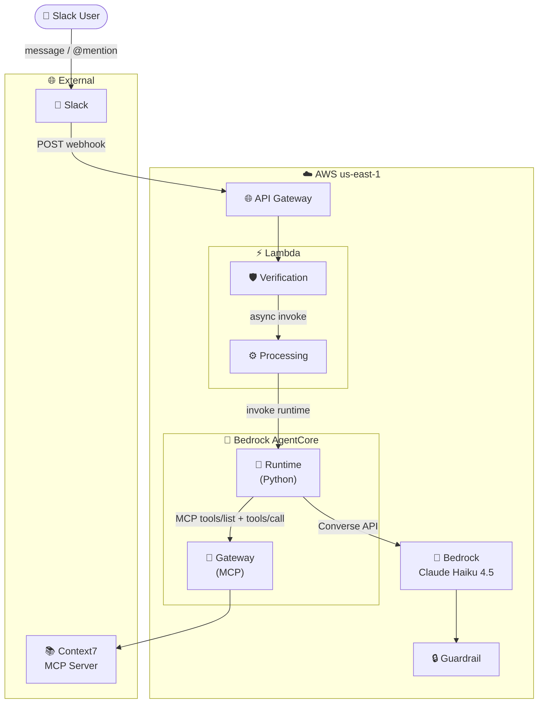

> This post was inspired by [Integrating Amazon Bedrock AgentCore with Slack](https://github.com/aws-samples/sample-Integrating-Amazon-Bedrock-AgentCore-with-Slack)

It walks through deploying a [Slack](https://slack.com/) bot powered by
[Amazon Bedrock AgentCore](https://docs.aws.amazon.com/bedrock-agentcore/latest/devguide/agentcore-get-started-toolkit.html)
using [OpenTofu](https://opentofu.org/). The bot integrates [Context7](https://context7.com/)
MCP tools for real-time documentation and code example lookups, enabling your
team to query programming libraries directly from Slack.

The architecture uses a fully serverless approach: API Gateway receives Slack
webhooks, Lambda functions handle verification and processing, and the
AgentCore Runtime runs the AI agent with [Claude Haiku 4.5](https://docs.anthropic.com/en/docs/about-claude/models)
as the foundation model. Security is handled via KMS encryption, Bedrock
Guardrails (PII filtering + content moderation), and Slack signature
verification.



The request flow:

1. A user sends a message in Slack (direct message or `@mention` in a channel).
2. Slack sends a webhook POST request to API Gateway.
3. The Verification Lambda retrieves Slack credentials from SSM Parameter Store
   and validates the request signature using HMAC-SHA256.
4. After verification, it async-invokes the Processing Lambda and returns `200`
   immediately (meeting Slack's 3-second timeout).
5. The Processing Lambda posts a "Processing your request..." placeholder in
   the Slack thread.
6. It invokes the AgentCore Runtime with the user's query and a session ID
   derived from the thread timestamp.
7. The Runtime discovers tools from the MCP Gateway (Context7) and runs a
   tool-use loop with the Bedrock Converse API.
8. The Bedrock Guardrail enforces content filtering and PII protection.
9. The response is converted to Slack's `mrkdwn` format and updates the
   placeholder message.

## Requirements

You will need to configure the [AWS CLI](https://docs.aws.amazon.com/cli/latest/userguide/cli-chap-configure.html)
and set up other necessary secrets and variables:

```shell
# AWS Credentials
export AWS_ACCESS_KEY_ID="xxxxxxxxxxxxxxxxxx"
export AWS_SECRET_ACCESS_KEY="xxxxxxxxxxxxxxxxxxxxxxxxxxxxxxxxxxxxxx"
export AWS_SESSION_TOKEN="xxxxxxxx"
```

Set the required environment variables:

```bash
# AWS Region
export AWS_REGION="${AWS_REGION:-us-east-1}"
# Project name used for resource naming
export PROJECT_NAME="${PROJECT_NAME:-slack-agentcore}"
# OpenTofu variables
export TF_VAR_tags="{\"Owner\":\"${MY_EMAIL:-petr.ruzicka@gmail.com}\",\"Environment\":\"dev\",\"Managed-by\":\"opentofu\"}"
# Working directory
export TMP_DIR="${TMP_DIR:-${PWD}/tmp}"
mkdir -pv "${TMP_DIR}/${PROJECT_NAME}"
```

Install the required tools:

- [OpenTofu](https://opentofu.org/)
- [AWS CLI](https://builder.aws.com/build/tools)
- [uv](https://docs.astral.sh/uv/)
- [Node.js](https://nodejs.org/)

## Create a Slack App

Before deploying infrastructure, you need to create a Slack app and obtain the
Bot Token and Signing Secret.

1. Go to [Slack API](https://api.slack.com/apps) and choose **Create New App**.


_Slack API - Create New App_

{:start="2"}
2. Choose **From scratch**.

{:width="400"}
_Create an app - From scratch_

{:start="3"}

3. Enter the **App Name** (`slack-agentcore`) and pick the workspace.
4. Choose **Create App**.

{:width="400"}
_Name app and choose workspace_

### Configure OAuth & Permissions

1. Navigate to **Features** > **OAuth & Permissions**.
2. Under **Bot Token Scopes**, add the following scopes:
   - `app_mentions:read`
   - `chat:write`
   - `im:history`
   - `im:read`
   - `im:write`


_Adding Bot Token Scopes_

{:start="3"}
3. Install the app to your workspace.


_Installing the app to the workspace_

{:start="4"}
4. Copy the **Bot User OAuth Token** (`xoxb-...`) - you will need this later.


_Copy the Bot User OAuth Token_

### Get the Signing Secret

1. Navigate to **Settings** > **Basic Information**.
2. Under **Signing Secret**, choose **Show** and copy the value.


_Copy the Signing Secret_

### Enable Direct Messages

1. Navigate to **Features** > **App Home**.
2. Enable **Allow users to send Slash commands and messages from the messages
   tab**.


_Enable direct messaging_

Set the Slack credentials obtained above as OpenTofu variables:

```bash
export TF_VAR_slack_bot_token="${SLACK_BOT_TOKEN}"
export TF_VAR_slack_signing_secret="${SLACK_SIGNING_SECRET}"
```

## Deploy the infrastructure with OpenTofu

{:width="300"}

The OpenTofu configuration deploys the following components:

- **KMS CMK** - encrypts SSM parameters and CloudWatch log groups
- **SSM Parameter Store** - stores Slack credentials as SecureString
- **Lambda (Verification)** - verifies Slack webhook signatures
- **Lambda (Processing)** - invokes AgentCore and updates Slack messages
- **API Gateway (HTTP API v2)** - single `POST /slack-events` route
- **S3 Bucket** - stores the agent runtime zip (KMS-encrypted, versioned)
- **Bedrock AgentCore Gateway** - MCP protocol gateway connecting to Context7
- **Bedrock Guardrail** - content filtering + PII protection
- **Bedrock AgentCore Runtime** - Python runtime with tool-use loop

### Main OpenTofu configuration

Write the main OpenTofu configuration with provider setup, locals, and data
sources:

```hcl
tee "${TMP_DIR}/${PROJECT_NAME}/main.tf" << \EOF
terraform {
  required_version = ">= 1.14"

  required_providers {
    aws = {
      source  = "hashicorp/aws"
      # renovate: datasource=terraform-provider depName=hashicorp/aws
      version = "~> 6.0"
    }
  }
}

provider "aws" {
  region = var.aws_region

  default_tags {
    tags = var.tags
  }
}

locals {
  lambda_runtime = "nodejs24.x"

  pii_block = [
    "PASSWORD", "CREDIT_DEBIT_CARD_NUMBER", "PIN",
    "INTERNATIONAL_BANK_ACCOUNT_NUMBER", "SWIFT_CODE",
    "AWS_ACCESS_KEY", "AWS_SECRET_KEY",
    "US_SOCIAL_SECURITY_NUMBER", "US_INDIVIDUAL_TAX_IDENTIFICATION_NUMBER",
    "US_BANK_ACCOUNT_NUMBER", "US_BANK_ROUTING_NUMBER",
    "CA_HEALTH_NUMBER", "CA_SOCIAL_INSURANCE_NUMBER",
    "UK_UNIQUE_TAXPAYER_REFERENCE_NUMBER", "UK_NATIONAL_INSURANCE_NUMBER",
    "UK_NATIONAL_HEALTH_SERVICE_NUMBER",
  ]

  pii_anonymize = [
    "PHONE", "EMAIL", "ADDRESS", "DRIVER_ID", "LICENSE_PLATE",
    "VEHICLE_IDENTIFICATION_NUMBER", "MAC_ADDRESS",
  ]
}

data "aws_caller_identity" "current" {}
data "aws_region" "current" {}
EOF
```

### Infrastructure resources

Write the infrastructure resources (KMS, SSM, Lambda, API Gateway, S3,
AgentCore):

```hcl
tee "${TMP_DIR}/${PROJECT_NAME}/infrastructure.tf" << \EOF
# -----------------------------------------------------------------------------
# KMS CMK - encrypts SSM SecureString parameters and CloudWatch log groups
# -----------------------------------------------------------------------------

module "kms" {
  source  = "terraform-aws-modules/kms/aws"
  # renovate: datasource=terraform-module depName=terraform-aws-modules/kms/aws
  version = "4.2.0"

  description             = "KMS key for ${var.project_name}"
  deletion_window_in_days = 7
  aliases                 = [var.project_name]

  key_statements = [
    {
      sid        = "AllowCloudWatchLogs"
      principals = [{ type = "Service", identifiers = ["logs.${data.aws_region.current.region}.amazonaws.com"] }]
      actions = [
        "kms:Encrypt*", "kms:Decrypt*", "kms:ReEncrypt*",
        "kms:GenerateDataKey*", "kms:Describe*",
      ]
      resources = ["*"]
      condition = [{
        test     = "ArnLike"
        variable = "kms:EncryptionContext:aws:logs:arn"
        values   = ["arn:aws:logs:${data.aws_region.current.region}:${data.aws_caller_identity.current.account_id}:*"]
      }]
    },
  ]
}

# -----------------------------------------------------------------------------
# SSM Parameter Store - Slack credentials
# -----------------------------------------------------------------------------

resource "aws_ssm_parameter" "slack_bot_token" {
  name        = "/${var.project_name}/slack/bot-token"
  description = "Slack Bot User OAuth Token"
  type        = "SecureString"
  key_id      = module.kms.key_arn
  value       = var.slack_bot_token
}

resource "aws_ssm_parameter" "slack_signing_secret" {
  name        = "/${var.project_name}/slack/signing-secret"
  description = "Slack app signing secret"
  type        = "SecureString"
  key_id      = module.kms.key_arn
  value       = var.slack_signing_secret
}

# -----------------------------------------------------------------------------
# Lambda - Verification (reads Slack secrets from SSM, verifies signature)
# -----------------------------------------------------------------------------

module "lambda_verification" {
  source  = "terraform-aws-modules/lambda/aws"
  # renovate: datasource=terraform-module depName=terraform-aws-modules/lambda/aws
  version = "8.8.0"

  function_name = "${var.project_name}-verification"
  description   = "Verifies Slack webhook signatures using SSM Parameter Store"
  handler       = "index.handler"
  runtime       = local.lambda_runtime
  publish       = true
  timeout       = 10

  cloudwatch_logs_retention_in_days = 1
  cloudwatch_logs_kms_key_id        = module.kms.key_arn

  source_path = "${path.module}/lambda/verification"

  environment_variables = {
    SLACK_BOT_TOKEN_PARAM      = aws_ssm_parameter.slack_bot_token.name
    SLACK_SIGNING_SECRET_PARAM = aws_ssm_parameter.slack_signing_secret.name
    PROCESSING_FUNCTION        = module.lambda_processing.lambda_function_name
    LOG_LEVEL                  = "INFO"
  }

  attach_policy_statements = true
  policy_statements = {
    ssm_read = {
      effect = "Allow"
      actions = [
        "ssm:GetParameter",
        "ssm:GetParameters",
      ]
      resources = [
        aws_ssm_parameter.slack_bot_token.arn,
        aws_ssm_parameter.slack_signing_secret.arn,
      ]
    }
    kms_decrypt = {
      effect    = "Allow"
      actions   = ["kms:Decrypt"]
      resources = [module.kms.key_arn]
    }
    lambda_invoke = {
      effect    = "Allow"
      actions   = ["lambda:InvokeFunction"]
      resources = [module.lambda_processing.lambda_function_arn]
    }
  }

  allowed_triggers = {
    api_gateway = {
      service    = "apigateway"
      source_arn = "${module.api_gateway.api_execution_arn}/*/*"
    }
  }
}

# -----------------------------------------------------------------------------
# Lambda - Processing (posts "Processing...", invokes AgentCore, updates Slack)
# -----------------------------------------------------------------------------

module "lambda_processing" {
  source  = "terraform-aws-modules/lambda/aws"
  # renovate: datasource=terraform-module depName=terraform-aws-modules/lambda/aws
  version = "8.8.0"

  function_name = "${var.project_name}-processing"
  description   = "Processes Slack events: posts status, invokes AgentCore Runtime, updates Slack"
  handler       = "index.handler"
  runtime       = local.lambda_runtime
  publish       = true
  timeout       = 300
  memory_size   = 256

  cloudwatch_logs_retention_in_days = 1
  cloudwatch_logs_kms_key_id        = module.kms.key_arn

  source_path = [
    {
      path             = "${path.module}/lambda/processing"
      npm_requirements = true
    }
  ]

  environment_variables = {
    AGENT_CORE_RUNTIME_ARN = aws_bedrockagentcore_agent_runtime.main.agent_runtime_arn
    LOG_LEVEL              = "INFO"
  }

  attach_policy_statements = true
  policy_statements = {
    agentcore_invoke = {
      effect  = "Allow"
      actions = ["bedrock-agentcore:InvokeAgentRuntime"]
      resources = [
        aws_bedrockagentcore_agent_runtime.main.agent_runtime_arn,
        "${aws_bedrockagentcore_agent_runtime.main.agent_runtime_arn}/runtime-endpoint/*",
      ]
    }
  }

  # Async invocation config (no DLQ - relies on Lambda auto-retries + CloudWatch)
  create_async_event_config    = true
  maximum_retry_attempts       = 2
  maximum_event_age_in_seconds = 3600
}

# -----------------------------------------------------------------------------
# API Gateway (HTTP API v2)
# -----------------------------------------------------------------------------

module "api_gateway" {
  source  = "terraform-aws-modules/apigateway-v2/aws"
  # renovate: datasource=terraform-module depName=terraform-aws-modules/apigateway-v2/aws
  version = "6.1.0"

  name          = "${var.project_name}-api"
  description   = "Slack webhook endpoint for Bedrock AgentCore integration"
  protocol_type = "HTTP"

  create_domain_name    = false
  create_domain_records = false
  create_certificate    = false

  disable_execute_api_endpoint = false

  routes = {
    "POST /slack-events" = {
      integration = {
        uri                    = module.lambda_verification.lambda_function_arn
        payload_format_version = "2.0"
        timeout_milliseconds   = 10000
      }
    }
  }

  stage_access_log_settings = {
    create_log_group            = true
    log_group_retention_in_days = 1
    format = jsonencode({
      requestId      = "$context.requestId"
      ip             = "$context.identity.sourceIp"
      requestTime    = "$context.requestTime"
      httpMethod     = "$context.httpMethod"
      routeKey       = "$context.routeKey"
      status         = "$context.status"
      protocol       = "$context.protocol"
      responseLength = "$context.responseLength"
    })
  }
}

# -----------------------------------------------------------------------------
# S3 Bucket for Agent Runtime code
# -----------------------------------------------------------------------------

module "s3_agent_code" {
  source  = "terraform-aws-modules/s3-bucket/aws"
  # renovate: datasource=terraform-module depName=terraform-aws-modules/s3-bucket/aws
  version = "5.14.0"

  bucket_prefix = "${var.project_name}-agent-code-"
  force_destroy = true

  versioning = {
    enabled = true
  }

  server_side_encryption_configuration = {
    rule = {
      apply_server_side_encryption_by_default = {
        sse_algorithm     = "aws:kms"
        kms_master_key_id = module.kms.key_arn
      }
      bucket_key_enabled = true
    }
  }

  attach_deny_insecure_transport_policy = true
  attach_require_latest_tls_policy      = true
}

resource "terraform_data" "agent_runtime_build" {
  triggers_replace = [
    filemd5("${path.module}/agent-runtime/agent_runtime.py"),
    filemd5("${path.module}/agent-runtime/requirements.txt"),
  ]

  provisioner "local-exec" {
    command     = <<-EOT
      set -e
      rm -rf .build/agent-runtime-package
      mkdir -p .build/agent-runtime-package
      uv pip install \
        --python-platform aarch64-manylinux2014 \
        --python-version 3.12 \
        --target .build/agent-runtime-package \
        --only-binary=:all: \
        -r agent-runtime/requirements.txt
      cp agent-runtime/agent_runtime.py .build/agent-runtime-package/
      cd .build/agent-runtime-package && zip -rq ../agent-runtime.zip . -x "*.pyc" -x "*__pycache__*"
    EOT
    working_dir = path.module
  }
}

resource "aws_s3_object" "agent_runtime_code" {
  depends_on = [terraform_data.agent_runtime_build]

  bucket      = module.s3_agent_code.s3_bucket_id
  key         = "agent-runtime.zip"
  source      = "${path.module}/.build/agent-runtime.zip"
  source_hash = sha256("${filesha256("${path.module}/agent-runtime/agent_runtime.py")}${filesha256("${path.module}/agent-runtime/requirements.txt")}")
}

# -----------------------------------------------------------------------------
# Bedrock AgentCore - Gateway (connects to Context7 MCP server)
# -----------------------------------------------------------------------------

resource "aws_iam_role" "agentcore_gateway" {
  name = "${var.project_name}-agentcore-gateway"

  assume_role_policy = jsonencode({
    Version = "2012-10-17"
    Statement = [{
      Effect = "Allow"
      Action = "sts:AssumeRole"
      Principal = {
        Service = "bedrock-agentcore.amazonaws.com"
      }
      Condition = {
        StringEquals = {
          "aws:SourceAccount" = data.aws_caller_identity.current.account_id
        }
      }
    }]
  })
}

resource "aws_bedrockagentcore_gateway" "main" {
  name            = "${var.project_name}-gateway"
  description     = "MCP Gateway for Context7 documentation tools"
  role_arn        = aws_iam_role.agentcore_gateway.arn
  authorizer_type = "AWS_IAM"
  protocol_type   = "MCP"

  protocol_configuration {
    mcp {
      instructions       = "Gateway providing access to Context7 MCP documentation and code example tools"
      search_type        = "SEMANTIC"
      supported_versions = ["2025-03-26"]
    }
  }
}

resource "aws_bedrockagentcore_gateway_target" "context7" {
  name               = "context7-mcp-target"
  gateway_identifier = aws_bedrockagentcore_gateway.main.gateway_id
  description        = "Context7 MCP server for documentation and code examples"

  target_configuration {
    mcp {
      mcp_server {
        endpoint = "https://mcp.context7.com/mcp"
      }
    }
  }
}

# -----------------------------------------------------------------------------
# Bedrock Guardrail (AI safety + PII protection)
# -----------------------------------------------------------------------------

resource "aws_bedrock_guardrail" "main" {
  name                      = "${var.project_name}-ai-safety"
  description               = "Guardrail for AI model safety and PII compliance"
  blocked_input_messaging   = "Input contains blocked content"
  blocked_outputs_messaging = "Output contains blocked content"

  content_policy_config {
    filters_config {
      type            = "SEXUAL"
      input_strength  = "HIGH"
      output_strength = "HIGH"
    }
    filters_config {
      type            = "PROMPT_ATTACK"
      input_strength  = "HIGH"
      output_strength = "NONE"
    }
  }

  sensitive_information_policy_config {
    dynamic "pii_entities_config" {
      for_each = local.pii_block
      content {
        type   = pii_entities_config.value
        action = "BLOCK"
      }
    }
    dynamic "pii_entities_config" {
      for_each = local.pii_anonymize
      content {
        type   = pii_entities_config.value
        action = "ANONYMIZE"
      }
    }
  }
}

# -----------------------------------------------------------------------------
# Bedrock AgentCore - Runtime
# -----------------------------------------------------------------------------

resource "aws_iam_role" "agentcore_runtime" {
  name = "${var.project_name}-agentcore-runtime"

  assume_role_policy = jsonencode({
    Version = "2012-10-17"
    Statement = [{
      Effect = "Allow"
      Action = "sts:AssumeRole"
      Principal = {
        Service = "bedrock-agentcore.amazonaws.com"
      }
      Condition = {
        StringEquals = {
          "aws:SourceAccount" = data.aws_caller_identity.current.account_id
        }
      }
    }]
  })
}

data "aws_iam_policy_document" "agentcore_runtime" {
  statement {
    sid    = "BedrockInvokeModel"
    effect = "Allow"
    actions = [
      "bedrock:InvokeModel",
      "bedrock:Converse",
      "bedrock:ConverseStream",
    ]
    resources = [
      "arn:aws:bedrock:*::foundation-model/${var.foundation_model}",
      "arn:aws:bedrock:*:${data.aws_caller_identity.current.account_id}:inference-profile/${var.foundation_model}",
    ]
    condition {
      test     = "StringEquals"
      variable = "bedrock:GuardrailIdentifier"
      values   = [aws_bedrock_guardrail.main.guardrail_arn]
    }
  }

  statement {
    sid       = "BedrockApplyGuardrail"
    effect    = "Allow"
    actions   = ["bedrock:ApplyGuardrail"]
    resources = [aws_bedrock_guardrail.main.guardrail_arn]
  }

  statement {
    sid       = "InvokeGateway"
    effect    = "Allow"
    actions   = ["bedrock-agentcore:InvokeGateway"]
    resources = [aws_bedrockagentcore_gateway.main.gateway_arn]
  }

  statement {
    sid    = "CloudWatchLogs"
    effect = "Allow"
    actions = [
      "logs:CreateLogGroup",
      "logs:CreateLogStream",
      "logs:PutLogEvents",
    ]
    resources = ["arn:aws:logs:${data.aws_region.current.region}:${data.aws_caller_identity.current.account_id}:log-group:/aws/bedrock-agentcore/runtimes/${var.project_name}*"]
  }

  statement {
    sid    = "S3ReadAgentCode"
    effect = "Allow"
    actions = [
      "s3:GetObject",
      "s3:GetObjectVersion",
    ]
    resources = ["${module.s3_agent_code.s3_bucket_arn}/*"]
  }

  statement {
    sid       = "S3ListAgentCodeBucket"
    effect    = "Allow"
    actions   = ["s3:ListBucket"]
    resources = [module.s3_agent_code.s3_bucket_arn]
  }
}

resource "aws_iam_role_policy" "agentcore_runtime" {
  name   = "agentcore-runtime-policy"
  role   = aws_iam_role.agentcore_runtime.id
  policy = data.aws_iam_policy_document.agentcore_runtime.json
}

resource "aws_iam_role_policy_attachment" "agentcore_runtime" {
  role       = aws_iam_role.agentcore_runtime.name
  policy_arn = "arn:aws:iam::aws:policy/BedrockAgentCoreFullAccess"
}

resource "aws_bedrockagentcore_agent_runtime" "main" {
  agent_runtime_name = replace("${var.project_name}_runtime", "-", "_")
  description        = "Slack-integrated agent using Context7 MCP tools"
  role_arn           = aws_iam_role.agentcore_runtime.arn

  agent_runtime_artifact {
    code_configuration {
      runtime     = "PYTHON_3_12"
      entry_point = ["agent_runtime.py"]

      code {
        s3 {
          bucket = module.s3_agent_code.s3_bucket_id
          prefix = aws_s3_object.agent_runtime_code.key
        }
      }
    }
  }

  network_configuration {
    network_mode = "PUBLIC"
  }

  protocol_configuration {
    server_protocol = "HTTP"
  }

  environment_variables = {
    GATEWAY_ARN       = aws_bedrockagentcore_gateway.main.gateway_arn
    MODEL_ID          = var.foundation_model
    AWS_REGION        = data.aws_region.current.region
    GUARDRAIL_ID      = aws_bedrock_guardrail.main.guardrail_arn
    GUARDRAIL_VERSION = "DRAFT"
  }
}
EOF
```

### OpenTofu variables

Write the OpenTofu variables file:

```hcl
tee "${TMP_DIR}/${PROJECT_NAME}/variables.tf" << \EOF
variable "aws_region" {
  description = "AWS region for deployment"
  type        = string
  default     = "us-east-1"
}

variable "project_name" {
  description = "Project name used for resource naming"
  type        = string
  default     = "slack-agentcore"
}

variable "slack_bot_token" {
  description = "Slack Bot User OAuth Token (xoxb-...)"
  type        = string
  sensitive   = true
}

variable "slack_signing_secret" {
  description = "Slack app signing secret for webhook verification"
  type        = string
  sensitive   = true
}

variable "foundation_model" {
  description = "Bedrock foundation model ID for the agent"
  type        = string
  default     = "us.anthropic.claude-haiku-4-5-20251001-v1:0"
}

variable "tags" {
  description = "Tags applied to all AWS resources"
  type        = map(string)
}
EOF
```

### OpenTofu outputs

```hcl
tee "${TMP_DIR}/${PROJECT_NAME}/outputs.tf" << \EOF
output "webhook_url" {
  description = "Slack webhook URL to configure in Event Subscriptions"
  value       = "${module.api_gateway.api_endpoint}/slack-events"
}
EOF
```

### Lambda - Verification function

The Verification Lambda handles Slack URL verification challenges, validates
webhook signatures using HMAC-SHA256 with timing-safe comparison, and
async-invokes the Processing Lambda to meet Slack's 3-second response timeout:

```javascript
mkdir -p "${TMP_DIR}/${PROJECT_NAME}/lambda/verification"
tee "${TMP_DIR}/${PROJECT_NAME}/lambda/verification/index.mjs" << \EOF
import { SSMClient, GetParameterCommand } from "@aws-sdk/client-ssm";
import { LambdaClient, InvokeCommand } from "@aws-sdk/client-lambda";
import { createHmac, timingSafeEqual } from "crypto";

const ssm = new SSMClient();
const lambda = new LambdaClient();
const LOG_LEVEL = process.env.LOG_LEVEL || "INFO";
const log = {
  debug: (msg) => LOG_LEVEL === "DEBUG" && console.log("[DEBUG]", msg),
  info: (msg) => ["DEBUG", "INFO"].includes(LOG_LEVEL) && console.log("[INFO]", msg),
  error: (msg) => console.error("[ERROR]", msg),
};

// Cache SSM parameters across warm invocations
let cached = null;

async function getCredentials() {
  if (!cached) {
    log.info("Fetching credentials from SSM Parameter Store");
    const [token, secret] = await Promise.all([
      ssm.send(new GetParameterCommand({ Name: process.env.SLACK_BOT_TOKEN_PARAM, WithDecryption: true })),
      ssm.send(new GetParameterCommand({ Name: process.env.SLACK_SIGNING_SECRET_PARAM, WithDecryption: true })),
    ]);
    cached = { token: token.Parameter.Value, signingSecret: secret.Parameter.Value };
  }
  return cached;
}

function verifySignature(body, timestamp, signature, secret) {
  const computed = `v0=${createHmac("sha256", secret).update(`v0:${timestamp}:${body}`).digest("hex")}`;
  return timingSafeEqual(Buffer.from(signature), Buffer.from(computed));
}

export async function handler(event) {
  log.debug(`Event: ${JSON.stringify(event)}`);

  try {
    const headers = event.headers || {};
    const body = event.body;
    const parsed = typeof body === "string" ? JSON.parse(body) : body;

    // Slack URL verification challenge
    if (parsed.type === "url_verification") {
      log.info("URL verification challenge");
      return { statusCode: 200, headers: { "Content-Type": "application/json" }, body: JSON.stringify({ challenge: parsed.challenge }) };
    }

    // Validate signature headers
    const sig = headers["X-Slack-Signature"] || headers["x-slack-signature"];
    const ts = headers["X-Slack-Request-Timestamp"] || headers["x-slack-request-timestamp"];
    if (!sig || !ts || Math.abs(Date.now() / 1000 - parseInt(ts)) > 300) {
      return { statusCode: 403, body: '{"error":"Invalid request"}' };
    }

    // Verify Slack signature
    const creds = await getCredentials();
    const rawBody = typeof body === "string" ? body : JSON.stringify(body);
    if (!verifySignature(rawBody, ts, sig, creds.signingSecret)) {
      log.info("Signature verification failed");
      return { statusCode: 403, body: '{"error":"Invalid signature"}' };
    }

    // Async invoke processing Lambda
    log.info("Signature verified, invoking processing Lambda");
    await lambda.send(new InvokeCommand({
      FunctionName: process.env.PROCESSING_FUNCTION,
      InvocationType: "Event",
      Payload: JSON.stringify({ ...event, slackBotToken: creds.token }),
    }));

    return { statusCode: 200, body: '{"message":"OK"}' };
  } catch (error) {
    log.error(`Error: ${error.message}`);
    return { statusCode: error.message.includes("signature") ? 403 : 500, body: JSON.stringify({ error: error.message }) };
  }
}
EOF
```

### Lambda - Processing function

The Processing Lambda filters bot messages, posts a "Processing..." placeholder
in the Slack thread, invokes the AgentCore Runtime, and converts the markdown
response to Slack's `mrkdwn` format:

```bash
mkdir -p "${TMP_DIR}/${PROJECT_NAME}/lambda/processing"
tee "${TMP_DIR}/${PROJECT_NAME}/lambda/processing/package.json" << \EOF
{
  "name": "processing",
  "version": "1.0.0",
  "type": "commonjs",
  "dependencies": {
    "markdown-to-slack-mrkdwn": "^1.1.2"
  }
}
EOF
```

```javascript
tee "${TMP_DIR}/${PROJECT_NAME}/lambda/processing/index.mjs" << \EOF
import {
  BedrockAgentCoreClient,
  InvokeAgentRuntimeCommand,
} from "@aws-sdk/client-bedrock-agentcore";
import https from "https";
import { markdownToSlack, splitForSlack } from "markdown-to-slack-mrkdwn";

const client = new BedrockAgentCoreClient();
const LOG_LEVEL = process.env.LOG_LEVEL || "INFO";
const log = {
  debug: (msg) => LOG_LEVEL === "DEBUG" && console.log("[DEBUG]", msg),
  info: (msg) => ["DEBUG", "INFO"].includes(LOG_LEVEL) && console.log("[INFO]", msg),
  error: (msg) => console.error("[ERROR]", msg),
};

function callSlack(url, token, data) {
  return new Promise((resolve, reject) => {
    const req = https.request(url, {
      method: "POST",
      headers: { Authorization: `Bearer ${token}`, "Content-Type": "application/json" },
    }, (res) => {
      let d = "";
      res.on("data", (c) => (d += c));
      res.on("end", () => { try { resolve(JSON.parse(d)); } catch { resolve(d); } });
    });
    req.on("error", reject);
    req.write(JSON.stringify(data));
    req.end();
  });
}

async function invokeAgentCore(runtimeArn, prompt, sessionId) {
  const payload = JSON.stringify({ prompt, sessionId, userId: sessionId });
  const cmd = new InvokeAgentRuntimeCommand({
    agentRuntimeArn: runtimeArn,
    runtimeSessionId: sessionId,
    accept: "application/json, text/event-stream",
    contentType: "application/json",
    payload: Buffer.from(payload),
  });

  const response = await client.send(cmd);
  const chunks = [];
  for await (const chunk of response.response) chunks.push(chunk);
  const raw = Buffer.concat(chunks).toString("utf-8");

  log.debug(`Raw response: ${raw.substring(0, 500)}`);

  // Parse based on content type
  if (response.contentType === "application/json") {
    const data = JSON.parse(raw);
    if (data.response) return data.response;
    if (data.message?.content) return data.message.content.filter((i) => i.text).map((i) => i.text).join("\n");
    return data.message || JSON.stringify(data);
  }

  // SSE or plain text
  if (raw.includes("data: ")) {
    return raw.split("\n").filter((l) => l.startsWith("data: ")).map((l) => l.slice(6).trim()).join("");
  }
  return raw;
}

export async function handler(event) {
  log.debug(`Event: ${JSON.stringify(event)}`);

  try {
    const body = typeof event.body === "string" ? JSON.parse(event.body) : event.body;

    if (body.type !== "event_callback" || !body.event) {
      return { statusCode: 200, body: '{"message":"OK"}' };
    }

    const e = body.event;

    // Filter: ignore bots, non-user, non-relevant events
    if (e.bot_id || e.subtype === "bot_message" || e.subtype === "message_changed") {
      log.info("Ignoring bot message");
      return { statusCode: 200, body: '{"message":"ignored"}' };
    }
    if (!(e.type === "app_mention" || (e.type === "message" && e.channel_type === "im"))) {
      return { statusCode: 200, body: '{"message":"OK"}' };
    }
    if (!e.user) return { statusCode: 200, body: '{"message":"no user"}' };

    const slackBotToken = event.slackBotToken;
    const threadTs = e.thread_ts || e.ts;

    // Post "Processing..." placeholder
    log.info("Processing event, posting processing message to Slack");
    const posted = await callSlack("https://slack.com/api/chat.postMessage", slackBotToken, {
      channel: e.channel, text: "Processing your request...", thread_ts: threadTs,
    });
    if (!posted.ok || !posted.ts) {
      log.error(`Slack postMessage failed: ${posted.error}`);
      return { statusCode: 500, body: '{"error":"slack post failed"}' };
    }

    // Build session ID from thread timestamp
    const sessionId = `slack-thread-${threadTs}`.replace(/\./g, "_").padEnd(33, "0");
    const userMessage = (e.text || "").replace(/<@[A-Z0-9]+>/g, "").trim();

    if (!userMessage) {
      await callSlack("https://slack.com/api/chat.update", slackBotToken, {
        channel: e.channel, ts: posted.ts, text: "I received an empty message. Please try again.",
      });
      return { statusCode: 200, body: '{"message":"empty"}' };
    }

    // Invoke AgentCore and get response
    log.info(`Invoking AgentCore for session: ${sessionId}`);
    let completion;
    try {
      completion = await invokeAgentCore(process.env.AGENT_CORE_RUNTIME_ARN, userMessage, sessionId);
    } catch (err) {
      log.error(`AgentCore error: ${err.name} ${err.message}`);
      completion = "I'm experiencing technical difficulties. Please try again later.";
    }

    // Strip model thinking tags and convert to Slack format
    completion = completion
      .replace(/<thinking>[\s\S]*?<\/thinking>/gi, "")
      .replace(/<response>([\s\S]*?)<\/response>/gi, "$1")
      .trim() || "I received your message but got an empty response.";

    const slackText = markdownToSlack(completion);

    // Update the processing message with the first chunk
    const chunks = splitForSlack(slackText, 3500);
    log.info(`Updating message ts: ${posted.ts}`);
    await callSlack("https://slack.com/api/chat.update", slackBotToken, {
      channel: e.channel, ts: posted.ts, text: chunks[0],
    });

    // Send remaining chunks as thread replies
    for (let i = 1; i < chunks.length; i++) {
      await callSlack("https://slack.com/api/chat.postMessage", slackBotToken, {
        channel: e.channel, text: chunks[i], thread_ts: threadTs,
      });
    }

    return { statusCode: 200, body: '{"message":"OK"}' };
  } catch (error) {
    log.error(`Processing error: ${error.message}`);
    throw error;
  }
}
EOF
```

### Agent Runtime (Python)

The AgentCore Runtime is a Python application that runs on Bedrock AgentCore.
It uses SigV4-signed requests to communicate with the MCP Gateway, discovers
tools, and runs a tool-use loop with the Bedrock Converse API:

```bash
mkdir -p "${TMP_DIR}/${PROJECT_NAME}/agent-runtime"
tee "${TMP_DIR}/${PROJECT_NAME}/agent-runtime/requirements.txt" << \EOF
boto3==1.43.27
bedrock-agentcore>=1.0.0
urllib3>=2.0.0
EOF
```

```python
tee "${TMP_DIR}/${PROJECT_NAME}/agent-runtime/agent_runtime.py" << \EOF
"""
Agent Runtime for Slack integration with Bedrock AgentCore.

Uses BedrockAgentCoreApp runtime from bedrock-agentcore SDK:
1. Receives prompts via /invocations (handled by @app.entrypoint)
2. Calls AgentCore Gateway (Context7 MCP) for tool discovery and execution
3. Uses Bedrock Converse API with tool-use loop for multi-step reasoning
4. Returns final response
"""

import json
import logging
import os

import boto3
from botocore.auth import SigV4Auth
from botocore.awsrequest import AWSRequest
import urllib3

from bedrock_agentcore.runtime import BedrockAgentCoreApp

# Configuration
GATEWAY_ARN = os.environ.get("GATEWAY_ARN", "")
MODEL_ID = os.environ.get("MODEL_ID", "us.anthropic.claude-haiku-4-5-20251001-v1:0")
AWS_REGION = os.environ.get("AWS_REGION", "us-east-1")
GUARDRAIL_ID = os.environ.get("GUARDRAIL_ID", "")
GUARDRAIL_VERSION = os.environ.get("GUARDRAIL_VERSION", "DRAFT")
LOG_LEVEL = os.environ.get("LOG_LEVEL", "INFO")

logging.basicConfig(level=getattr(logging, LOG_LEVEL))
logger = logging.getLogger(__name__)

gateway_id = GATEWAY_ARN.split("/")[-1] if "/" in GATEWAY_ARN else ""
GATEWAY_URL = f"https://{gateway_id}.gateway.bedrock-agentcore.{AWS_REGION}.amazonaws.com/mcp"

SYSTEM_PROMPT = """You are a helpful AI assistant integrated with Slack.
You have access to Context7 documentation and code example tools through your MCP gateway.
Use these tools to provide accurate, up-to-date information about programming libraries,
frameworks, and their documentation.

When answering questions:
- Use the available tools to look up current documentation and code examples
- Provide accurate, well-formatted responses suitable for Slack
- Include code examples when relevant
- Be concise but thorough
- If you cannot find information, say so clearly rather than guessing
"""

bedrock_client = boto3.client("bedrock-runtime", region_name=AWS_REGION)
http = urllib3.PoolManager()

app = BedrockAgentCoreApp()


# ---------------------------------------------------------------------------
# MCP Gateway Client (SigV4-signed JSON-RPC)
# ---------------------------------------------------------------------------

def _mcp_request(method_name, params=None):
    """Send a JSON-RPC request to the MCP Gateway."""
    payload = {"jsonrpc": "2.0", "id": 1, "method": method_name}
    if params:
        payload["params"] = params

    body = json.dumps(payload).encode()
    headers = {"Content-Type": "application/json", "Accept": "application/json, text/event-stream"}

    session = boto3.Session()
    creds = session.get_credentials().get_frozen_credentials()
    aws_req = AWSRequest(method="POST", url=GATEWAY_URL, data=body, headers=headers)
    SigV4Auth(creds, "bedrock-agentcore", AWS_REGION).add_auth(aws_req)
    signed = dict(aws_req.headers)
    signed["Content-Type"] = "application/json"
    signed["Accept"] = "application/json, text/event-stream"

    resp = http.request("POST", GATEWAY_URL, body=body, headers=signed, timeout=30.0)
    if resp.status != 200:
        logger.error("MCP request failed: %d %s", resp.status, resp.data.decode())
        return None

    data = resp.data.decode()
    if data.startswith("data:"):
        for line in data.split("\n"):
            if line.startswith("data:"):
                json_str = line[5:].strip()
                if json_str:
                    return json.loads(json_str)
    else:
        return json.loads(data)
    return None


def get_mcp_tools():
    """Fetch available tools from the MCP Gateway."""
    _mcp_request("initialize", {
        "protocolVersion": "2025-03-26",
        "capabilities": {},
        "clientInfo": {"name": "agentcore-runtime", "version": "1.0.0"},
    })
    _mcp_request("notifications/initialized")
    result = _mcp_request("tools/list")
    if not result or "result" not in result:
        return []
    tools = result["result"].get("tools", [])
    logger.info("Discovered %d MCP tools", len(tools))
    return tools


def call_mcp_tool(tool_name, arguments):
    """Call a tool via the MCP Gateway."""
    result = _mcp_request("tools/call", {"name": tool_name, "arguments": arguments})
    if not result or "result" not in result:
        return {"error": f"Tool call failed: {result}"}
    content = result["result"].get("content", [])
    texts = [c.get("text", "") for c in content if c.get("type") == "text"]
    return {"result": "\n".join(texts)} if texts else {"result": json.dumps(content)}


# ---------------------------------------------------------------------------
# Bedrock Converse with Tool-Use Loop
# ---------------------------------------------------------------------------

def invoke_with_tools(prompt, mcp_tools, max_iterations=5):
    """Run the Bedrock Converse tool-use loop."""
    messages = [{"role": "user", "content": [{"text": prompt}]}]

    tool_config = None
    if mcp_tools:
        tool_configs = [{
            "toolSpec": {
                "name": t["name"],
                "description": t.get("description", ""),
                "inputSchema": {"json": t.get("inputSchema", {"type": "object", "properties": {}})},
            }
        } for t in mcp_tools]
        tool_config = {"tools": tool_configs}

    for _ in range(max_iterations):
        kwargs = {"modelId": MODEL_ID, "messages": messages, "system": [{"text": SYSTEM_PROMPT}]}
        if tool_config:
            kwargs["toolConfig"] = tool_config
        if GUARDRAIL_ID:
            kwargs["guardrailConfig"] = {"guardrailIdentifier": GUARDRAIL_ID, "guardrailVersion": GUARDRAIL_VERSION}

        response = bedrock_client.converse(**kwargs)
        message = response["output"]["message"]
        stop_reason = response.get("stopReason", "")
        messages.append(message)

        if stop_reason == "tool_use":
            tool_results = []
            for block in message.get("content", []):
                if "toolUse" in block:
                    tu = block["toolUse"]
                    logger.info("Calling tool: %s", tu["name"])
                    result = call_mcp_tool(tu["name"], tu.get("input", {}))
                    tool_results.append({
                        "toolResult": {
                            "toolUseId": tu["toolUseId"],
                            "content": [{"text": result.get("result", json.dumps(result))}],
                        }
                    })
            messages.append({"role": "user", "content": tool_results})
            continue

        texts = [b.get("text", "") for b in message.get("content", []) if "text" in b]
        return "\n".join(texts) if texts else "I processed your request but got an empty response."

    return "I reached the maximum number of tool-use iterations. Here's what I have so far."


# ---------------------------------------------------------------------------
# AgentCore Runtime Entrypoint
# ---------------------------------------------------------------------------

@app.entrypoint
def invoke(payload):
    """Main agent entrypoint - handles /invocations."""
    prompt = payload.get("prompt", "")
    logger.info("Invocation - prompt: %s", prompt[:80])

    # Debug mode
    if prompt.strip().lower().startswith("debug:"):
        debug_info = {"gateway_url": GATEWAY_URL, "gateway_arn": GATEWAY_ARN}
        try:
            debug_info["initialize_result"] = _mcp_request("initialize", {
                "protocolVersion": "2025-03-26", "capabilities": {},
                "clientInfo": {"name": "agentcore-runtime", "version": "1.0.0"},
            })
            debug_info["tools_list_result"] = _mcp_request("tools/list")
        except Exception as e:
            debug_info["error"] = str(e)
        return {"response": json.dumps(debug_info, indent=2)}

    # Fetch MCP tools and run tool-use loop
    mcp_tools = []
    if GATEWAY_ARN:
        try:
            mcp_tools = get_mcp_tools()
        except Exception as e:
            logger.warning("Failed to fetch MCP tools: %s", e)

    result = invoke_with_tools(prompt, mcp_tools)

    return {"response": result}


if __name__ == "__main__":
    app.run()
EOF
```

### Deploy with OpenTofu

Initialize and apply the OpenTofu configuration:

```bash
tofu -chdir="${TMP_DIR}/${PROJECT_NAME}" init
tofu -chdir="${TMP_DIR}/${PROJECT_NAME}" apply -auto-approve
```

After a successful deployment, OpenTofu outputs the webhook URL:

```bash
tofu -chdir="${TMP_DIR}/${PROJECT_NAME}" output -raw webhook_url
```

## Configure Slack Event Subscriptions

After obtaining the webhook URL from the OpenTofu output, complete the Slack
app configuration.

1. Return to [Slack API](https://api.slack.com/apps) and select your app.


_Select your Slack app_

{:start="2"}

2. Navigate to **Features** > **Event Subscriptions**.
3. Toggle **Enable Events** to **On**.
4. Paste the webhook URL in the **Request URL** field.
5. After the URL is verified (green checkmark), under **Subscribe to bot
   events** add:

- `app_mention`
- `message.im`

6. Choose **Save Changes**.


_Configure Event Subscriptions with the webhook URL_

{:start="7"}
7. Navigate to **Settings** > **Install App** and choose **Reinstall** to apply
   the new event subscriptions.


_Reinstall the app to activate event subscriptions_

## Test the integration

Locate the app in the **Apps** section of Slack. You can invite it to a channel
with `/invite @slack-agentcore`, or message it directly.


_Adding the bot to a Slack channel_

**Direct messaging**: Go to the app in the Apps section and chat one-on-one.
The bot posts "Processing your request..." as an initial response, then
replaces it with the actual answer from AgentCore.


_Direct conversation with the AgentCore bot_

**Channel integration**: Mention `@slack-agentcore` in any channel where the
bot is installed.


_Channel integration - mentioning the bot_

## Architecture details

### Session management

Slack organizes conversations into threads identified by timestamps. The
solution derives session IDs directly from Slack thread timestamps, ensuring
initial messages and replies in a thread share the same AgentCore session. This
isolates different threads into separate sessions without external state
management.

### Asynchronous processing

AgentCore invocations can exceed
[Slack's 3-second webhook timeout](https://docs.slack.dev/tools/java-slack-sdk/guides/slash-commands/),
especially when the agent performs multiple tool calls. The architecture uses
two Lambda functions:

1. **Verification Lambda** - validates the Slack signature and returns HTTP 200
   immediately
2. **Processing Lambda** - posts a placeholder message, invokes AgentCore,
   and updates the message with the response

### Security

- **KMS CMK** encrypts all SSM parameters and CloudWatch logs
- **Slack signature verification** with HMAC-SHA256 and timing-safe comparison
- **Replay protection** rejects requests older than 5 minutes
- **Bedrock Guardrail** enforces content filtering (sexual content, prompt
  attacks) and PII protection (blocks passwords, credit cards, SSN; anonymizes
  phone numbers, emails, addresses)
- **IAM least-privilege** roles for Lambda, AgentCore Runtime, and Gateway

### MCP Gateway integration

The [AgentCore Gateway](https://docs.aws.amazon.com/bedrock-agentcore/latest/devguide/gateway.html)
provides a standardized interface for tool access with [SigV4](https://docs.aws.amazon.com/general/latest/gr/signature-version-4.html)
authentication. The Runtime uses a custom SigV4-signed HTTP client to
communicate with the Gateway, which routes requests to the [Context7 MCP server](https://context7.com/)
for documentation and code example lookups.

## Cleanup

Destroy all resources created by OpenTofu:

{:width="100"}

```sh
tofu -chdir="${TMP_DIR}/${PROJECT_NAME}" destroy -auto-approve
rm -rf "${TMP_DIR:?}/${PROJECT_NAME:?}"
```
